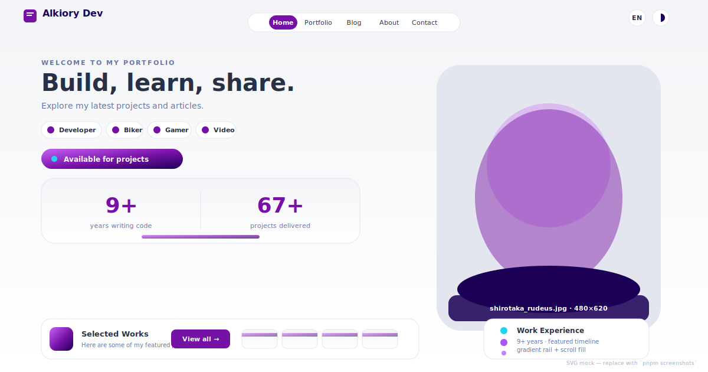
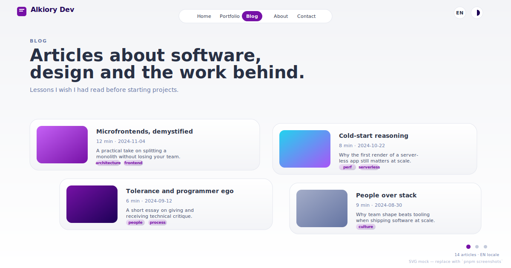
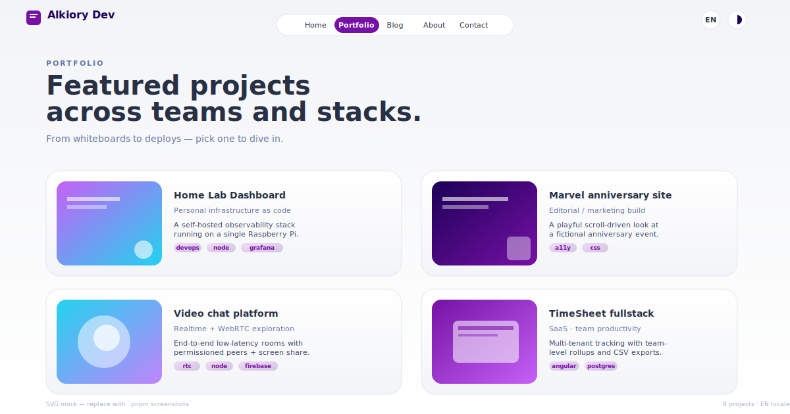

# Alkiory Portfolio

Personal bilingual portfolio + blog, built with [Astro](https://astro.build).
Live at **[alkiory.com](https://alkiory.com)** (also reachable on `alkiory.web.app`).

## Screenshots

<p align="center">
  
  
</p>
<p align="center">
  
</p>

The PNGs under `public/screenshots/` are autogenerated from the live EN build with Playwright as 1200×630 sibling files (`home.png`, `blog.png`, `portfolio.png`). The SVGs above stay committed as a reliable fallback. Regenerate the PNGs with:

```sh
pnpm install
npx playwright install chromium
pnpm screenshots
```

You can switch the locale or theme:

```sh
pnpm screenshots -- --locale=es
pnpm screenshots -- --theme=dark
```

## Features

- **Astro Content Layer** — typed collections for `blog` and `work` (`src/content.config.ts`).
- **Pathname-based i18n** — `/es/` and `/en/` routes with a fully-typed translation dictionary (`src/data/i18n.ts`).
- **MDX + Mermaid** rendered inline in posts.
- **Theme toggle** — dark/light with `prefers-color-scheme` + `localStorage` persistence.
- **Responsive components** — timeline, skills grid, status badge, project/blog previews.
- **Accessibility-first** — semantic landmarks, `:focus-visible`, and `prefers-reduced-motion` baked in.
- **SEO** — per-locale sitemap via `@astrojs/sitemap`, deterministic trailing-slash output.
- **Static deploy via Docker** — multi-stage build, Nginx non-root on port `3000`, with healthcheck.

## Use as a template

1. In `astro.config.mjs` set your `site` URL and adjust `i18n.locales`; mirror the locale entries in `src/data/i18n.ts`.
2. Drop your projects under `src/content/work/<lang>/` and articles under `src/content/blog/<lang>/`.
3. Update socials in `src/data/socials.ts` and work history in `src/data/companies.ts`.
4. Run `pnpm dev` to iterate, then `pnpm build` for a static output in `./dist`.

## Stack

Astro · TypeScript · Tailwind CSS 4 (`@tailwindcss/vite`).
MDX, Mermaid, Zod, `@astrojs/mdx`, `@astrojs/sitemap`.

## Scripts

```sh
pnpm install
pnpm dev        # http://localhost:4321
pnpm build      # static output → ./dist
pnpm preview
```

Requires Node `>=22.12.0` and pnpm `>=11.5.1`.

## Docker

```sh
docker compose up --build
```

Serves the static build on port `3000` behind Nginx.

## License

Released under MIT. Add a `LICENSE` file at the repo root if you fork this template.
