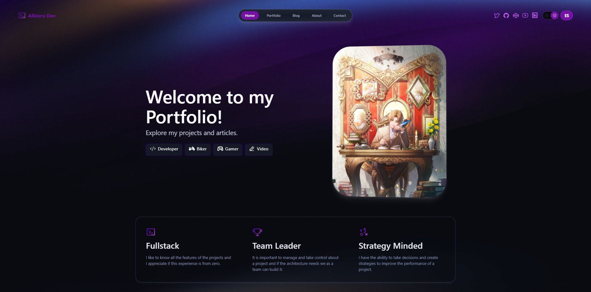

# Alkiory Portfolio

This is my personal portfolio website built with Astro, a modern web framework for building fast, scalable, and secure websites.

## Features

* A clean and minimalistic design
* A responsive layout that works well on desktop and mobile devices
* Bilingual content (English / Spanish) with locale-aware routing
* A gallery of my projects with links to the live demos and source code
* A blog with technical articles and translations
* A contact page with my email and links to my social profiles

## Technologies Used

* Astro: a modern web framework for building fast, scalable, and secure websites
* Tailwind CSS (via `@tailwindcss/vite`): a utility-first CSS framework for styling the website
* TypeScript: a statically typed JavaScript language for writing the code
* Markdown / MDX: lightweight markup languages for the blog and portfolio content

## Development

To develop this project, you'll need to have Node.js installed on your computer. Then, you can use the following commands:
