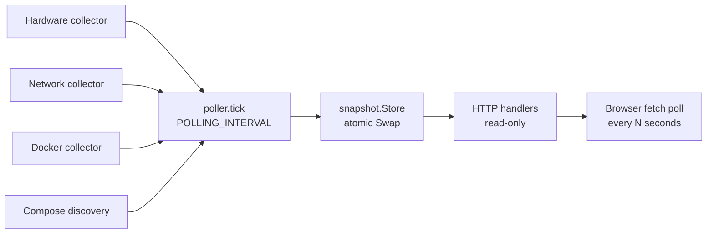

<!-- snippet: architecture-en | canonical mermaid block for ../work/en/home-lab-dashboard.md -->

```mermaid
graph LR
  H[Hardware collector] --> P[poller.tick<br/>POLLING_INTERVAL]
  N[Network collector] --> P
  D[Docker collector] --> P
  Y[Compose discovery] --> P
  P --> S[snapshot.Store<br/>atomic Swap]
  S --> R[HTTP handlers<br/>read-only]
  R --> B[Browser fetch poll<br/>every N seconds]
```
