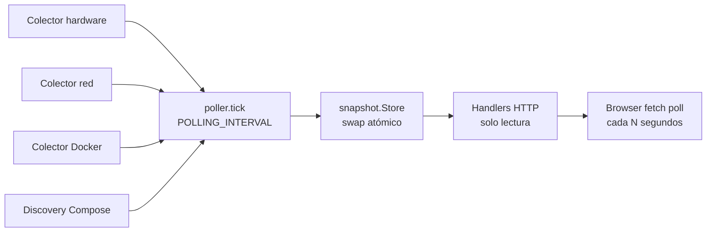

<!-- snippet: architecture-es | bloque canónico para ../work/es/home-lab-dashboard.md -->

```mermaid
graph LR
  H[Colector hardware] --> P[poller.tick<br/>POLLING_INTERVAL]
  N[Colector red] --> P
  D[Colector Docker] --> P
  Y[Discovery Compose] --> P
  P --> S[snapshot.Store<br/>swap atómico]
  S --> R[Handlers HTTP<br/>solo lectura]
  R --> B[Browser fetch poll<br/>cada N segundos]
```
