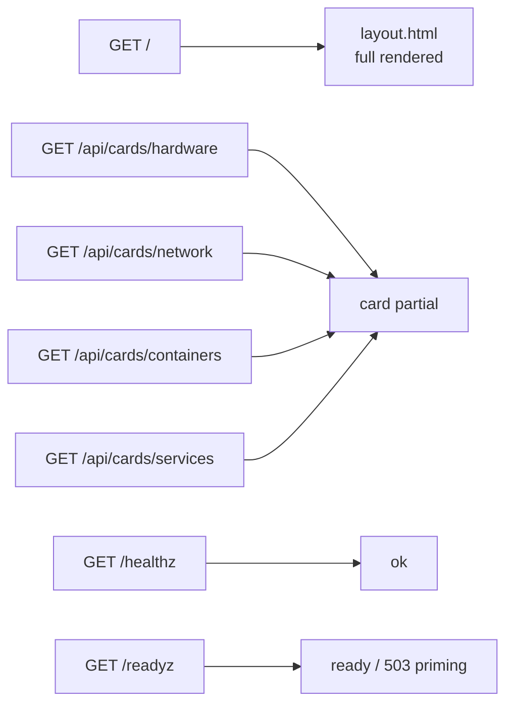

<!-- snippet: user-navigation-en | canonical mermaid block for ../work/en/home-lab-dashboard.md -->

```mermaid
graph LR
  GET_ROOT["GET /"] --> LAYOUT["layout.html<br/>full rendered"]
  GET_HW["GET /api/cards/hardware"] --> PARTIAL["card partial"]
  GET_NW["GET /api/cards/network"] --> PARTIAL
  GET_CT["GET /api/cards/containers"] --> PARTIAL
  GET_SV["GET /api/cards/services"] --> PARTIAL
  GET_HEALTH["GET /healthz"] --> OK["ok"]
  GET_READY["GET /readyz"] --> READY["ready / 503 priming"]
```
