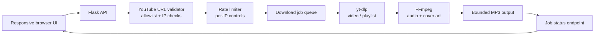

#### 🧠 Project Overview

YouTube Audio Downloader is a focused utility for a common offline-listening
workflow: paste a permitted YouTube URL, choose a video or playlist, and
receive MP3 audio with the source artwork embedded as cover art. The
project keeps the user experience deliberately small while taking the
operational details seriously — long-running downloads, input validation,
resource limits, rate limiting and container hardening are all part of the
application rather than afterthoughts.

It supports individual videos and playlists of up to 50 items. A download
is started as a job, and the browser polls its status until the generated
file is ready. That job model prevents a long `yt-dlp` process from blocking
the initial HTTP request and gives the UI a place to communicate progress,
retry behavior and upstream failures.

This is a self-hosted tool, not a public hosted downloader. The repository
also documents an important deployment reality: YouTube may challenge
requests from cloud datacenter IPs even when the same application works
locally from a residential connection. The implementation does not try to
hide or bypass that restriction; it keeps the behavior explicit and asks
operators to keep `yt-dlp` current.

#### ✨ Core Features

- **High-quality MP3 conversion** with FFmpeg and embedded cover art from
  the source media where available.
- **Playlist support** capped at 50 videos by default, with a configurable
  limit to protect the host from accidental oversized jobs.
- **Asynchronous download jobs** tracked through `/api/download/<job_id>`
  so the browser can poll long-running work without holding the original
  request open.
- **Responsive interface** designed for desktop and mobile use, including
  user-friendly handling of `429` responses and `Retry-After` headers.
- **Configurable resource controls** for concurrent workers, timeouts,
  source file size, bitrate and download directory.
- **Docker-first deployment** with a ready-to-run Compose setup and a
  published Docker Hub repository for repeatable image-based installs.

#### 🏗️ Architecture: Request, Job and Media Pipeline

The service is a small Flask application with an explicit boundary between
request validation, background download work and file delivery.



The flow is designed around a few clear boundaries:

- **The browser never executes a downloader process.** It sends a URL to
  the API and receives a job identifier, while the backend owns extraction,
  conversion and cleanup.
- **Validation happens before work is scheduled.** The URL must belong to
  an allowed YouTube domain and is checked against private, loopback,
  link-local, reserved and CGNAT address ranges to reduce SSRF risk.
- **The job endpoint is intentionally pollable.** Status polling uses the
  default rate limit rather than the stricter download limit, so a long
  conversion can be followed once per second without exhausting the user's
  download quota.
- **Output limits are applied at the boundary.** File size, timeout,
  playlist size and concurrent worker settings keep a self-hosted instance
  from becoming an uncontrolled media-processing queue.

#### 🧰 Technologies Used

🐍 **Backend and media processing**

- **Python 3.11+** running a Flask web application and its API routes.
- **yt-dlp** for extracting permitted YouTube video and playlist media.
- **FFmpeg** for audio conversion and metadata/cover-art embedding.
- **Flask-Limiter**, with optional Redis support, for configurable hourly
  and daily per-IP limits.
- A small filesystem-backed job flow for finished files and temporary
  processing output.

🐳 **Packaging and operations**

- **Docker** with a minimal runtime image, a non-root user and dropped
  Linux capabilities.
- **Docker Compose** for a one-command local stack exposed on port 5000.
- Environment-based controls such as `MAX_PLAYLIST_SIZE`,
  `MAX_DOWNLOADS_PER_HOUR`, `MAX_DOWNLOADS_PER_DAY`,
  `MAX_CONCURRENT_DOWNLOADS`, `DOWNLOAD_TIMEOUT`, `BITRATE` and
  `MAX_FILE_SIZE_MB`.
- Python tests covering URL validation, playlist routing, rate limiting,
  media processing options and download endpoints.

#### 🔐 Security by Design

✅ **SSRF protection**

The URL validator uses a YouTube domain allowlist and validates both IPv4
and IPv6 resolution. Private, loopback, link-local, reserved and documented
CGNAT ranges are rejected before a downloader process can access them.

✅ **Input and filesystem safety**

URLs are validated before processing, filenames are sanitized to prevent
path traversal, source and output sizes are capped, and the API returns
generic client-facing errors instead of leaking internal stack traces.

✅ **XSS prevention**

Dynamic values are rendered through DOM-safe APIs and `textContent` rather
than raw HTML injection. That matters in a media tool because titles,
channel names and playlist metadata originate outside the application.

✅ **Container hardening**

The Docker image runs as a non-root user, drops all capabilities and enables
`no-new-privileges`. The runtime is intentionally kept small so the service
has a narrow and inspectable attack surface.

✅ **Abuse controls**

Hourly and daily per-IP download limits, maximum playlist size, concurrent
worker limits and timeouts make the operational cost visible and adjustable.
Rate limiting is disabled for local development by default and must be
explicitly enabled for online deployments, where `render.yaml` opts in.

#### 🚀 Run It with Docker

The repository is ready for a local Compose deployment:

```bash
git clone https://github.com/alkiory/downloader-yt.git
cd downloader-yt
docker-compose up -d
```

Then open `http://localhost:5000`. Operators can tune limits through an
`.env` file, inspect the service with `docker-compose logs -f`, and rebuild
with `docker-compose build --no-cache` when the image or dependencies change.

The published image is also available from Docker Hub for teams that prefer
to pull an image instead of building from source. Always use the tool only
for content you have permission to download and comply with YouTube's Terms
of Service and applicable law.

#### 🧪 Verification and Failure Handling

The backend test suite exercises the parts most likely to regress in a
utility like this:

- URL allowlisting and private-network rejection.
- Video versus playlist routing.
- Rate-limiter behavior and configurable limits.
- Safe download options and media processing.
- Download endpoints and asynchronous job status.

The browser also honors `Retry-After` on `429` responses, resumes polling
when appropriate and presents generic errors without exposing backend
implementation details. This keeps upstream restrictions and local resource
limits understandable instead of making them look like random failures.

#### 📈 Current Outcome

✔️ A complete Flask + yt-dlp + FFmpeg workflow for permitted audio
extraction, with single-video and playlist support.

✔️ A job-based API that stays responsive while longer downloads are being
processed.

✔️ Security controls that address SSRF, XSS, path traversal, rate abuse,
resource exhaustion and container privilege.

✔️ Reproducible Docker deployment through Compose and a published Docker
Hub image, with configuration documented for local and online environments.

#### 🔗 Get Started

Ready to inspect the code or run the container?

- 🐳 **[Pull the downloader image from Docker Hub](https://hub.docker.com/repository/docker/iamsergiocampbell/downloader-yt/general)**
- 💻 **[Read the source and security documentation on GitHub](https://github.com/alkiory/downloader-yt)**

Use Docker Hub when you want the shortest path to a repeatable local
installation. Use GitHub when you want to review the validator, job flow,
test suite or hardening decisions before building your own image.

##### 🧠 Building a self-hosted utility?

If you are packaging a media, automation or data-processing tool for
reliable self-hosted use and want to discuss job queues, resource limits or
container security, feel free to reach out 🚀

> **Legal notice:** This project is intended for personal use. Downloading
> content from YouTube may violate YouTube's Terms of Service. You are
> responsible for having the necessary rights and complying with all
> applicable laws; do not download or distribute copyrighted material
> without permission.
