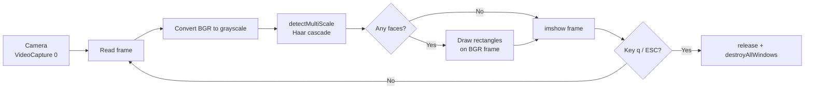

#### 🧠 Project Overview

Goal: a self-contained, single-file Python script that turns any
default laptop or USB webcam into a live face detector — useful as
a stepping stone for attendance systems, presence demos, computer-
vision onboarding material, and any other place where "is there a
face in this frame right now?" is the only thing that needs to be
answered.

It deliberately stays small: no deep-learning framework, no
dataset download, no GPU. The whole thing runs on top of the
OpenCV Haar cascade classifier that ships with the library, so the
script is clone-and-run on any machine that has Python 3 and a
working camera.

Current features:

- Opens the default camera with `cv2.VideoCapture(0)` and reads
  frames in a tight `while True` loop.
- Converts each BGR frame to grayscale before inference — Haar
  cascades only operate on single-channel intensity images, and
  skipping this conversion is the single most common source of
  false negatives for first-time users.
- Runs `detectMultiScale(...)` with conservative `scaleFactor`
  and `minNeighbors` values so the detector prefers fewer high-
  confidence boxes over many noisy ones.
- Draws one rectangle per detected face directly on the BGR
  frame so the user sees the *source* color stream, not the
  grayscale working copy.
- Releases the camera cleanly on `q` / `ESC` so the OS does not
  keep the device locked after the window is closed.

#### 🏗️ Architecture: Frame-Loop Pipeline

The whole script is a single sequential pipeline: capture →
preprocess → detect → annotate → display → repeat. There is no
state between iterations beyond the cascade classifier itself,
which keeps the program easy to reason about and easy to wrap in
a unit test that swaps the camera for a recorded video file.

This shape lets us:

- Treat the camera as a swappable input by replacing
  `VideoCapture(0)` with a `VideoCapture("input.mp4")` for
  offline testing without changing any downstream code.
- Re-use the grayscale conversion as a natural seam for any
  future histogram equalization or CLAHE normalization step.
- Stop the loop with a single breaking condition so there is no
  risk of leaving the camera device locked when the user closes
  the window.

#### 🧰 Technologies Used

🐍 Runtime / libraries

- **Python 3** as the scripting language — chosen so the script
  can be edited live and re-run without a compile step.
- **OpenCV (`cv2`)** as the single dependency for camera I/O,
  color conversion, cascade loading, detection, drawing and the
  display window.
- **Haar Cascade Classifier** (the pre-trained `haarcascade_frontalface_default.xml`
  shipped with OpenCV) as the detector. CPU-friendly, deterministic,
  and good enough for frontal faces in well-lit indoor scenes.
- **NumPy** (transitively, via OpenCV) for the per-frame buffer
  that backs both the BGR and the grayscale views.

🛠️ Tooling

- **pip** for dependency installation (`pip install opencv-python`).
- Any standard editor — the script is a single Python file with
  no project scaffolding.

#### 🔐 Key Technical Decisions

✅ 1. Haar cascades instead of a DNN detector

DNN face detectors (YuNet, RetinaFace, MediaPipe) are more
accurate, but every one of them pulls a model file plus a
runtime like ONNX, Mediapipe or a TF Lite interpreter. For a
script whose value proposition is "clone, install, run",
Haar cascades lower the bar enough that a reader without any ML
background can mentally map the code line by line.

✅ 2. Default camera as the input source

`cv2.VideoCapture(0)` works on any laptop and on any USB
webcam that registers as `/dev/video0`. There is no CLI flag to
configure, no path to a device to guess. The first run "just
works" on the most common hardware.

✅ 3. Single-file deliverable

No `requirements.txt`, no package layout, no entry-point. The
repository is the file. The trade-off is that scaling beyond a
demo (logging, multiple cameras, headless mode) would require
restructuring — but that is not what the script is for.

#### 📈 Current Outcome

✔️ Self-contained script that runs on a fresh Python install with
one `pip install`.

✔️ Real-time face detection at interactive frame rates on a CPU
laptop, no GPU required.

✔️ Clean exit path so the camera device is always released on
quit — no `LED stays on after Ctrl+C` surprises.

✔️ Ready as a learning base: swap the cascade for a DNN, swap the
camera for a video file, or wrap the loop in a Flask endpoint —
the framing of the pipeline makes any of these a localized edit.

#### 📎 Conclusion

Real-time face detection is a "hello world" with a webcam: small
enough to fit in one file, big enough to surface every concept a
later CV project will reuse — device capture, preprocessing,
inference, annotation and clean shutdown. Keeping the surface
this small is what makes the script a useful teaching artifact:
a reader can hold the whole program in their head and then
substitute pieces one at a time.

Want to read the source or fork it as a starting point for your
own detector?

- 🔗 [Repository](https://github.com/SergioCampbell/faceReconition)

##### 🧠 Working on a similar CV pipeline?

If you are scaling this up to multi-camera capture, headless
deployment or a DNN detector and want to talk through the
trade-offs, feel free to reach out 🚀
