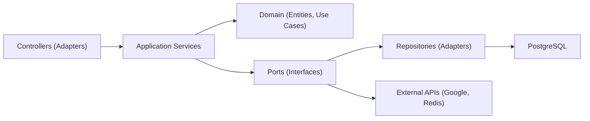
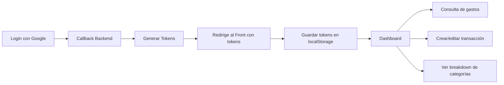
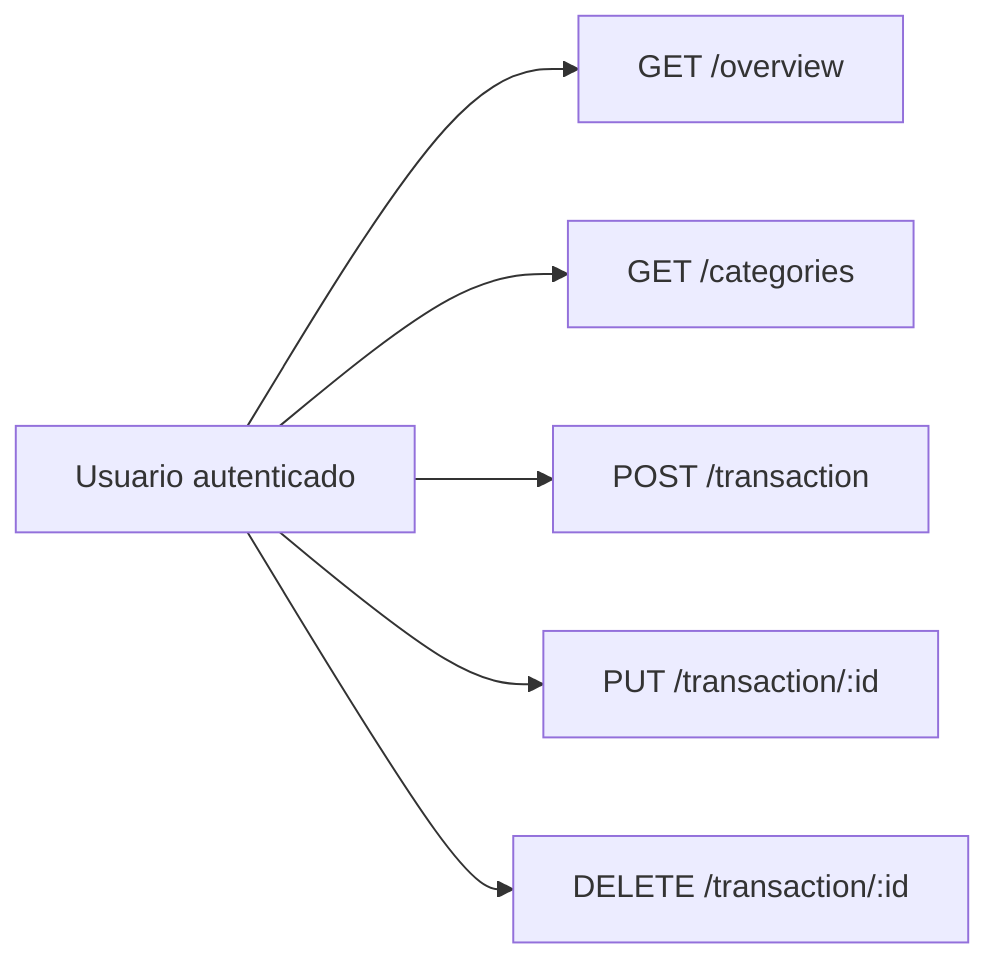

#### 🧠 Project Overview

Goal: Allow users to easily manage their personal finances from any device, visualizing key metrics and spending patterns.
Current Features:

Google sign-up and login (OAuth2).
Dashboard with a monthly summary.
Breakdown of expenses by category.
Transaction management (create, edit, delete).
Responsive UX with support for app installation (PWA).
Interactive charts for visual insights.

#### 🏗️ Architecture: Hexagonal (Ports & Adapters)

We applied the hexagonal architecture pattern to decouple domains from infrastructure and prepare the code for scalability and testing.

This structure allows us to:

Easily test business rules (pure domain).
Change providers without altering core logic.
Adapt the backend to other frontends (mobile, CLI, etc.).

#### 🧰 Technologies Used

🔙 Backend (NestJS + TypeORM)
NestJS as a scalable framework with support for testing and dependency injection.
TypeORM + PostgreSQL for ORM and relational database.
Redis for caching (tokens, sessions).
Passport.js + OAuth2 for Google authentication.
JWT for access and refresh tokens.
Hexagonal architecture to separate domain, application, and infrastructure.

#### 🎨 Frontend (React + TailwindCSS)

React with Hooks and Context for lightweight state management.
TailwindCSS for a modern and responsive UI.
Recharts for interactive charts (pie, bar, etc.).
localStorage for token persistence (PWA-ready).
React Router DOM for declarative navigation.

#### 📦 Infraestructura y despliegue

Firebase Hosting for frontend + PWA + automatic HTTPS.
Render.com for the backend with externally connected PostgreSQL and Redis.
Google Cloud Console for OAuth2 configuration.
CORS, CSRF, and environment-controlled security.

#### 🌐 Navegación de usuario y flujos

🧭 General Navigation Flow

🧪 Key Use Cases

#### 🔐 Key Technical Decisions

✅ 1. Passwordless OAuth
Users created via Google have no password (null) and are authenticated solely via OAuth.
This is managed without affecting authorization flows or persistence.

✅ 2. JWT + localStorage for PWA
Migrated from httpOnly cookies to localStorage to enable BudgetGenius's use as a Progressive Web App.
This also facilitates offline functionality and background retries.

✅ 3. Firebase Hosting for Frontend
Leverages PWA, HTTPS, telemetry, redirects, and more.
Replaced Vercel to centralize on a platform offering better browser integration.

#### 📊 Charts and Data Visualization

An ExpenseCategories component was included with real-time visualization of:

Total expenses
Most expensive category
Percentage distribution with colors and tooltips These metrics come from a single overviewService.getBreakdownByCategory() service, reused across multiple views, adhering to the DRY principle.

#### 📈 Current Outcome

✔️ Functional MVP deployed

✔️ Users can authenticate and use the app

✔️ Complete Infrastructure: DB, backend, frontend, and OAuth

✔️ Solid foundation to continue scaling to premium features

#### 📝 Next Steps

Full offline support (background transactions)
Push notifications with Firebase
Premium subscriptions and payment gateway
Financial data export (CSV, PDF)

#### 📎 Conclusion

BudgetGenius demonstrates how it's possible to build a functional, robust, and modern app with open-source tools, good practices, and long-term architectural decisions.
We hope this experience serves as a guide for your next MVP, startup, or learning project.
Want to explore the code or contribute?

- 🌐  Live demo [Budget Genius IA](https://budgetgeniusia.web.app)

- 🔗 Fullstack Repository (NestJS) (private repo)

##### 🧠 Interested in building something similar?

Follow us on LinkedIn or contact us to collaborate 🚀
