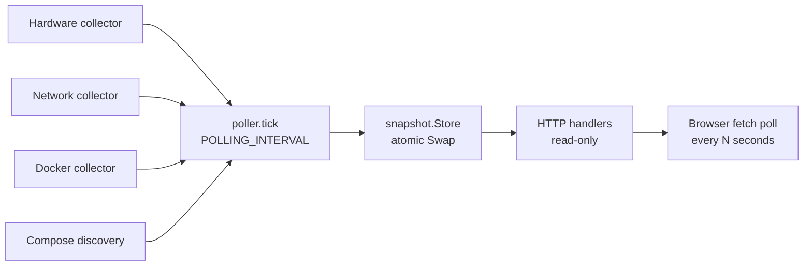
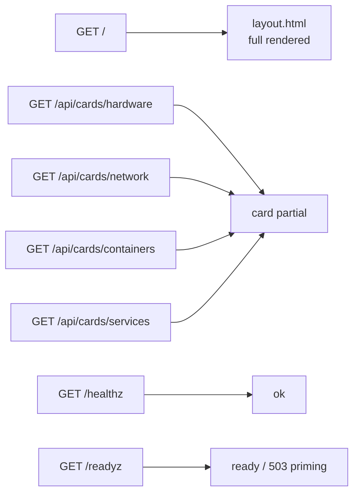
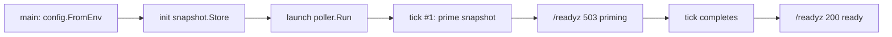

#### 🧠 Project Overview

Goal: give a home lab host a single page that answers the four
questions I keep asking it — *is the host alive, is the network
alive, are my containers healthy, what am I actually running* — and
nothing more than that. No historical graphs, no alerts, no agent
fleet.

Current Features:

- Four auto-refreshing cards: **Hardware** (CPU, memory, swap,
  disks, optional temperature), **Network** (interfaces, link
  state, addresses, bandwidth rates, public IP), **Containers**
  (state, health, CPU/memory, inline start/restart/stop), and
  **Services** (Compose projects with metadata labels).
- Self-hosted single Go binary, no SPA, no database, no
  third-party browser dependency.
- Docker is treated as optional — if the daemon disappears, the
  Containers card keeps the last good list and marks it stale
  instead of blanking out.
- Configurable environment variables for polling cadence,
  exposed port, title, log level, public-IP toggle, and the
  Compose-scan paths to walk.

#### 🏗️ Architecture: Snapshot + Poller

The runtime is a single goroutine of work plus an atomic swap and a
read-only HTTP layer on top.

<!-- canonical: ../snippets/architecture-en.md -->

This structure allows us to:

- Keep the only mutable shared state in one place — `snapshot.Store`
  — guarded by a single writer (the poller).
- Render HTTP responses from an immutable snapshot built fresh on
  every tick; handlers never call Docker, `/proc`, or external IP
  services directly.
- Recover gracefully from a Docker outage: the last good container
  list stays in the snapshot and is re-rendered with a stale
  badge.
- Wait out cold starts cleanly: `/readyz` returns `503 priming`
  until the first tick completes, so a reverse proxy can hold
  health checks without ever serving a half-initialized page.

#### 🧰 Technologies Used

🔙 Backend (Go standard library)

- Go 1.25 with `net/http`, `html/template`, `embed.FS`, and
  `log/slog` from the stdlib. No web framework, no template
  engine, no asset sidecar.
- `gopsutil/v3 v3.24.5` for hardware (CPU, memory, swap, disk,
  uptime) and network (interface counters, addresses) metrics.
- Docker SDK `v25.0.6+incompatible` for container state, health,
  and one-shot stats — read through a TCP socket proxy, never the
  raw socket.
- `gopkg.in/yaml.v3 v3.0.1` for the Compose-file scanner
  (`compose.yml`, `compose.yaml`, `docker-compose.yml`,
  `docker-compose.yaml`, depth-3, symlinks skipped).

🎨 Frontend (vanilla JavaScript + handcrafted CSS)

- One HTML template (`layout.html`) plus four card partials in
  `web/templates/partials/`.
- Handwritten CSS in `web/static/css/app.css`.
- Vanilla JavaScript in `web/static/js/app.js`: a small
  `setInterval` poller that calls the four `/api/cards/*`
  endpoints with `fetch()` and replaces the card innerHTML.
- No React, no HTMX, no framework, no build step.

#### 📦 Infrastructure and Deployment

- Multi-stage `Dockerfile`: Go 1.25 builder, `alpine:3.20`
  runtime with embedded assets and a non-root `appuser` account.
  Final image is roughly 22 MB compressed; resident memory under
  50 MB.
- `docker-compose.yml` running through
  `tecnativa/docker-socket-proxy` so the dashboard never touches
  `/var/run/docker.sock` directly. Compose scan mount is
  read-only (`/home/alkiory/projects:/projects:ro`).
- Network: external `npm_network` shared with the rest of the
  homelab, the same as Nginx Proxy Manager.
- No persistent storage, no migrations, one volume-less container
  per host.

#### 🌐 User Navigation and Flows

<!-- canonical: ../snippets/user-navigation-en.md -->

🧭 Cold-start sequence:

<!-- canonical: ../snippets/cold-start-en.md -->

#### 🔐 Key Technical Decisions

✅ 1. Snapshot + Poller over direct handler calls

The first version bound Docker SDK calls straight into HTTP
handlers. Every browser refresh hit the socket proxy at 100% CPU.
Moving the collection into a single goroutine that atomically
swaps `snapshot.Snapshot` reduced RSS from pegged to under 50 MB
and removed flicker.

✅ 2. Docker is a guest of the host, not a friend

The dashboard talks to Docker only through a TCP socket proxy
(`tecnativa/docker-socket-proxy`). Mounting
`/var/run/docker.sock` directly would mean a bug in the dashboard
is a bug in the host; the socket proxy keeps that surface narrow
and inspectable.

✅ 3. The four cards are the entire feature surface

A historical-graph view, an alerting pipeline, and an agent fleet
are out of scope. A home lab does not need Datadog; it needs the
only browser tab you keep open.

#### 📊 Data Visualization and Card Contents

Each card pulls straight from the snapshot. There is no
"dashboard-as-config" — the cards have a fixed shape and the
poller decides what fills them.

- **Hardware:** CPU model and utilization, memory and swap usage,
  per-disk usage filtered for virtual filesystems, hostname, OS,
  uptime. Temperature from `/sys/class/thermal/*` on Linux when
  readable from inside the container.
- **Network:** per-interface counters, current up/down state
  from `/sys/class/net/*/operstate`, link addresses, and
  bandwidth rates diffed against the previous tick. Public IP is
  cached for 60 seconds and disabled with `ENABLE_PUBLIC_IP=0`.
- **Containers:** listing with state, health, and the last
  observed CPU/memory snapshot. Inline `start`/`restart`/`stop`
  buttons; the server enforces a 20-second timeout per action.
- **Services:** Compose projects discovered from the configured
  scan roots with metadata sourced from `dashboard.*` /
  `homelab.*` labels. Only `http:` and `https:` URLs are
  rendered as links.

#### 📈 Current Outcome

✔️ Single-binary service in production across multiple home lab
hosts.

✔️ Cold-start path verified end-to-end — Docker socket-proxy is
ready before `/readyz` returns `200`.

✔️ Outage contract verified: Docker daemon restarts do not blank
the Containers card; the proxy going down is recoverable without
restarting the dashboard.

✔️ Build is reproducible: `go build .` from Go 1.25 reproduces
the binary byte-for-byte against the vendored lockfile.

#### 📎 Conclusion

hm-dashboard proves you can self-host a single page that covers
the four questions a home lab actually gets asked, with one Go
binary, no SPA, no database, and a Docker-as-optional contract
that holds even when Docker is the very thing being monitored.

The architectural choices — single goroutine for data collection,
atomic snapshot swap, read-only HTTP handlers, vanilla JS
front-end, behind a TCP socket proxy — were driven less by
novelty than by the simple rule that *the card that goes blank
when Docker hiccups is exactly the card you needed most*.

Want to read the source or run it on your own home lab?

- 🔗 [Repository](https://github.com/alkiory/hm-dashboard)

##### 🧠 Interested in a similar stack?

If you are spinning up your own home lab dashboard and want to
talk about the poller-only-writer contract or the Compose label
convention, feel free to reach out 🚀
