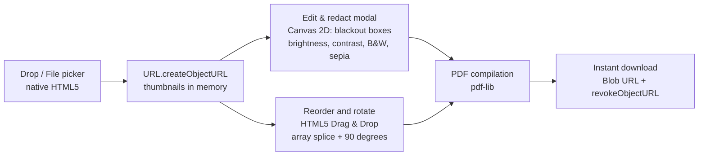
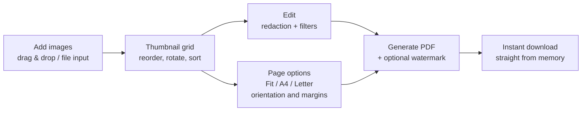

#### 🧠 Project Overview

Have you ever uploaded a photo of your ID or a bank statement to an
online "Image to PDF" converter? Most of us have, but the reality is
uncomfortable: we don't know which servers the files end up on,
whether temporary copies get stored, or how anonymous those services
really are.

With that concern in mind, I built my own solution and used it to
put a key principle into practice: **system design strictly driven
by use cases and simplicity (YAGNI)**.

Current Features:

- **100% client-side and private:** images never leave your
  device. Works completely offline.
- **Native drag & drop:** upload and reorder thumbnail cards using
  the HTML5 Drag & Drop API, no libraries.
- **Client-side editor and redaction:** blackout boxes over
  sensitive information (IDs, addresses, faces) and adjustable
  filters (brightness, contrast, B&W, sepia).
- **Tiled watermarks:** repeating diagonal stamping across all
  pages.
- **Page options:** fit to image, A4, or US Letter in Portrait,
  Landscape, or Auto orientation with custom margins.
- **Zero build step:** plain HTML5, CSS3, and JavaScript with
  pdf-lib.

#### 💡 The Initial Temptation vs. The Real Decision

At first, the typical development inertia invites you to set up:

- ❌ FastAPI backend + Docker
- ❌ Daemons and cron jobs to clean temporary files from disk
- ❌ React/Preact frontend + heavy drag & drop libraries + Tailwind
- ❌ Complex build pipelines (Vite/Webpack)

But does the use case actually need a server? The answer was **NO**.
Before writing any code, I audited the proposed architecture against
the use case and eliminated or replaced every layer that added
nothing:

| Proposed component | Decision | Rationale |
| :--- | :--- | :--- |
| FastAPI + Uvicorn | **Eliminated** | Processing files in-memory in the browser eliminates server costs, latency, network transfer, and server-side data leaks. |
| Temp storage & cleanup daemons | **Eliminated** | Browser RAM handles byte streams natively without disk I/O or race conditions. |
| Docker & cloud hosting | **Eliminated** | The static app runs on GitHub Pages or via `file:///` for $0/mo. |
| Preact + react-dropzone + dnd-kit | **Replaced with native HTML5** | `<input type="file" multiple>`, `<label for="...">`, and the native Drag & Drop API replaced 200MB+ of `node_modules`. |
| Tailwind + bundlers | **Replaced with vanilla CSS** | Modern CSS with variables, flexbox, and grid eliminates the entire build pipeline. |
| Node/Jest test runner | **Replaced with in-browser runner** | `test.html` validates PDF generation, ordering, watermarks, and canvas filters directly in any browser. |

#### 🏗️ Architecture: two static files

The result is an application consisting of **two static files**
(`index.html` + `pdf-lib.min.js`), deployable to GitHub Pages with
infinite scalability, maximum privacy, and zero maintenance.

The pipeline in detail:

1. **Ingestion:** native file input and drag-and-drop events read
   the selected `File` objects and assign random IDs and lightweight
   object URLs. Nothing touches a disk or a server.
2. **Client-side redaction and editing:** when editing, the image
   is rendered onto an offscreen canvas. The user draws blackout
   rectangles to mask sensitive text; redactions and color matrix
   adjustments are rendered to a JPEG canvas stream.
3. **Reordering and state management:** cards use native HTML5
   drag events (`dragstart`, `dragover`, `drop`) to reorder the
   item array in memory.
4. **PDF generation (`pdf-lib`):** direct lossless embedding for
   unedited JPEGs and PNGs (preserves original fidelity and bypasses
   re-encoding); rotated, filtered, or redacted images go through
   the Canvas 2D API. Scaling calculations adjust the image aspect
   ratio to the chosen page size (fit to image, A4, US Letter) and
   margins. If a watermark is requested, `StandardFonts.HelveticaBold`
   is stamped in a repeating diagonal grid across the entire page.
5. **Zero-server export:** the compiled byte array is wrapped in a
   `Blob`, attached to an ephemeral anchor tag, triggered for
   download, and cleaned up from memory via `URL.revokeObjectURL`.

#### 🔐 Key Technical Decisions

✅ 1. Zero bytes transferred

Images are processed in the browser's RAM. Total privacy, zero
latency, and full offline support. The use case — converting
sensitive documents — is precisely the worst possible scenario for
uploading bytes to a third party.

✅ 2. Native HTML5 instead of node_modules

The Canvas 2D API, native Drag & Drop, and `<input type="file">`
replaced hundreds of megabytes of dependencies. The only external
artifact is `pdf-lib.min.js`, served locally next to the HTML.

✅ 3. Redaction is a privacy feature, not a design one

Being able to cover sensitive data with blackout boxes *before*
generating the PDF is part of the same privacy contract: the edit
never touches the original image and never leaves the browser.

✅ 4. $0/mo infrastructure

No backend, no containers, no cron jobs, no pipelines. The entire
operation is a GitHub Pages deployment (or opening `index.html`
directly in the browser) plus an in-browser test suite (`test.html`)
that validates PDFs, ordering, and watermarks with zero host
dependencies.

#### 📊 User Surface

#### 📈 Current Outcome

✔️ Full app in production on GitHub Pages — two static files, zero
pipeline.

✔️ Privacy contract verified by design: there is no server
infrastructure that could store anything.

✔️ Automated test suite running in-browser (`test.html`) with no
Node runner or host dependencies.

✔️ Offline-capable: once loaded, the page needs no connection at
all.

#### 📎 Conclusion

Sometimes the best architecture is not the one that adds more layers
or microservices, but the one brave enough to **remove them** when
the use case allows it. imageToPdf proves that a converter with
editing, redaction, watermarks, and page control needs nothing more
than native HTML5 and a client-side PDF library — zero bytes
transferred, zero infrastructure, zero maintenance.

Want to try it or read the source code?

- 🔗 [Repository](https://github.com/alkiory/imageToPdf)
- 🌐 [Demo](https://alkiory.github.io/imageToPdf/)

##### 🧠 Interested in a similar approach?

If you are evaluating whether your use case really needs a backend
(or want to talk about YAGNI and aggressive stack simplification),
feel free to reach out 🚀
