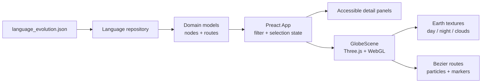

#### 🧠 Project Overview

Language History — *La Historia de Nuestra Voz* — is an interactive
atlas built around a simple question: **how can a complex story about
language, movement and culture become understandable at a glance?**

Instead of presenting the material as a long timeline or a wall of
text, the project places the story on a navigable 3D Earth. The globe
shows the relationship between historical milestones and migration
routes, while a focused educational panel gives each point in the
story enough context to explore without leaving the scene.

The application is intentionally self-contained. Its historical dataset
lives in `src/data/language_evolution.json`, the domain layer models
language nodes and routes, and the visual layer receives already-filtered
data rather than reaching into the dataset directly. That boundary keeps
the experience fast, predictable and easy to extend with new milestones
or cultural groups.

#### ✨ What You Can Explore

- **A layered 3D Earth** with day, night, cloud and atmospheric layers
  for a richer sense of depth than a conventional map.
- **Eight animated migration routes** drawn as Bézier curves with moving
  particles, making movement across the globe readable rather than
  reducing it to static lines.
- **Nine historical milestones** backed by a local JSON dataset and
  presented through a time filter covering the Paleolithic, Neolithic,
  dispersion, history and colonization, or the complete story.
- **Contextual detail panels** with tabs for summary, culture and
  contact, and a multimedia archive for the relevant historical record.
- **External cultural references** linked to Wikimedia Commons so the
  atlas can point curious visitors toward primary images and additional
  context without copying an entire archive into the application.
- **A responsive, keyboard-friendly interface** with visible focus
  states, ARIA roles and accessible tabs that remain useful on small
  screens as well as large displays.

#### 🏗️ Architecture: Domain Data Meets a WebGL Scene

The application is a static Vite frontend. Preact owns the lightweight
interface around the globe, while a deliberately isolated Three.js
component owns rendering, camera interaction, routes and atmosphere.



This separation gives the project a few useful properties:

- **The scene is data-driven.** `GlobeScene` receives filtered domain
  data and does not know how the application stores or selects it.
- **Filtering stays cheap.** The time filter operates on a small static
  dataset before the result reaches the renderer, rather than asking
  Three.js to decide which objects are visible.
- **The frontend needs no API or database.** A visitor can load the
  deployed experience from a CDN, and a contributor can change the
  dataset without standing up another service.
- **Visual assets are local.** Earth textures and the historical media
  archive are shipped with the build, avoiding hotlinking and CORS
  surprises during a presentation or classroom session.

#### 🧰 Technologies Used

🎨 **Presentation**

- **Preact** for the overlay UI, selection state, tabs, legend and
  time-filter controls with a small client-side footprint.
- **Three.js** directly, rather than through a scene abstraction, for
  the globe, camera controls, Fresnel-like atmosphere, markers, Bézier
  curves and animated route particles.
- **Tailwind CSS v4** plus handcrafted styles for the responsive panel,
  controls, focus states and visual hierarchy.

🧭 **Domain and tooling**

- **TypeScript in strict mode** across the domain, data and presentation
  layers so historical records and route relationships remain explicit.
- **Vite** for fast local development and a static production build.
- A local **JSON dataset** containing nine milestones and eight routes,
  with a small repository layer that keeps data access separate from the
  UI.
- **Firebase Hosting** serving the generated `dist/` directory with an
  SPA rewrite, HTTPS and a CDN-backed deployment.

#### 🎛️ Interaction Design Decisions

✅ **A globe instead of a flat map**

The spherical view makes migration feel like movement over a shared
planet. Day/night textures, clouds, stars and a subtle parallax effect
also provide visual cues for orientation without turning the interface
into a game or hiding the educational content behind effects.

✅ **Time filtering before exploration**

The era selector gives visitors a way to start with a manageable slice
of the story. The complete view remains available, but the default
interaction does not ask people to interpret every route and milestone
at once.

✅ **Panels instead of hover-only information**

Important context is not hidden in a tooltip. Selecting a marker opens a
structured panel with tabs, keyboard navigation and links to supporting
material. This makes the same information usable with a mouse, touch
input or assistive technology.

✅ **A local archive with attribution**

The N09 multimedia records are served from `public/media/` and retain
attribution, licensing and source links. That keeps the deployed atlas
reliable while respecting the provenance of the historical material.

#### 🚀 Build and Deployment

The project is a static application and can be run locally with Node.js
20 or newer:

```bash
npm install
npm run dev
```

For a production build:

```bash
npm run build
npm run preview
```

The repository includes Firebase Hosting configuration and a production
media validation step. The build verifies that the local archive has the
expected files, valid binary signatures and acceptable size limits before
assets are published. A Docker + Nginx alternative is also documented for
self-hosted deployments.

#### 📈 Current Outcome

✔️ A visually rich, backend-free atlas that loads historical data from a
versioned local source.

✔️ A clear domain/presentation boundary: data filtering happens in the
application layer and WebGL rendering stays isolated in `GlobeScene`.

✔️ An accessible responsive UI with visible focus, ARIA semantics,
keyboard navigation and a detail experience that works beyond hover.

✔️ A live Firebase deployment ready to explore in the browser, plus an
open source repository ready for new milestones, routes and cultural
records.

#### 🔗 Explore the Project

Want to explore the atlas first or inspect how the globe is built?

- 🚀 **[Open the live Language History atlas](https://languagehistoryalkiory.web.app/)**
- 💻 **[Read the source on GitHub](https://github.com/alkiory/languageHistory)**

The live experience is the best way to see the filters, animated routes
and detail panels working together. The repository is the place to start
if you want to contribute a new historical milestone, improve the
visualization or adapt the educational model to another dataset.

##### 🧠 Interested in an interactive data story?

If you are turning a timeline, map or research dataset into an engaging
web experience and want to talk about the boundary between domain data,
accessible UI and WebGL visualization, feel free to reach out 🚀
