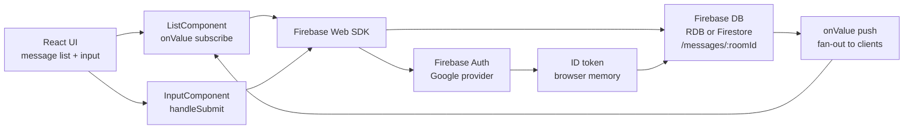

#### 🧠 Project Overview

Goal: a small real-time chat that proves you can ship a
production-shaped web application in a single sitting using
React on the client and Firebase on the backend. No server to
provision, no auth database to maintain, no WebSocket plumbing
to wire — Google sign-in for identity and a realtime database
for messages, then a one-line deploy to Firebase Hosting.

It was an onboarding project for the React + Firebase stack at a
time when the Firebase Realtime Database was still the simplest
way to wire live state from a browser without standing up a
backend. The intended outcome was *not* feature depth; it was
to internalize the deploy loop and the auth flow so that the
next project could start a step further along.

Current features:

- Google sign-in via Firebase Authentication — one click, no
  password stored anywhere, no email verification flow.
- Per-user message timeline persisted to the Firebase Realtime
  Database, with optimistic insert in the UI so the user sees
  their own message appear before the round-trip completes.
- Live message sync across open tabs and devices — every new
  message in the database is pushed down to every connected
  client in the same room.
- Lightweight UI: a Google avatar + display name per message,
  a single text field at the bottom, and a scrollable list that
  reflows as new entries arrive.
- Public demo hosted at `chat-react-c9d77.web.app` via Firebase
  Hosting, with HTTPS and a global CDN provided out of the box.

#### 🏗️ Architecture: React Frontend + Firebase Backend

The app is intentionally two-sided: the React client owns the
view layer, the Firebase SDKs own identity, persistence and live
sync. There is no custom server in the loop — every read and
write goes straight from the browser to a Firebase backend.

This shape lets us:

- Drop the entire backend by deleting one `firebaseConfig`
  object and re-pointing it at another project — there is no
  server to redeploy.
- Add a second room by introducing a `roomId` parameter and a
  second `<ListComponent />` — the auth + database plumbing does
  not change.
- Recover the exact deployed asset with `firebase serve` or by
  re-deploying from the same source — Hosting builds a hashed
  asset bundle and serves it from a CDN by path.

#### 🧰 Technologies Used

⚛️ Frontend (React)

- **React** as the view layer — functional and class components
  mixed, with state managed locally per component.
- **Firebase Web SDK (`firebase/app`, `firebase/auth`,
  `firebase/database`)** initialized once at app startup from a
  `firebaseConfig` object.
- **Realtime Database listeners** (`onValue`) wired into the
  message list component so the UI subscribes to updates
  instead of polling.
- A thin **CSS** layer (no framework era-appropriate) for
  spacing, the input bar and the avatar bubble.

☁️ Backend (Firebase, fully managed)

- **Firebase Authentication** with the **Google** sign-in
  provider — no passwords stored, one-click login.
- **Firebase Realtime Database** as the message store — JSON
  tree, fan-out on write, perfectly suited to a live chat.
- **Firebase Hosting** for the static React bundle, with HTTPS
  and a global CDN; deploy is a single
  `firebase deploy --only hosting` command.

🛠️ Tooling

- **Create React App** as the build tool — `npm start`,
  `npm run build`, ready to drop into the `public/` folder of
  Hosting.
- **firebase-tools** as the CLI for `firebase init`,
  `firebase deploy` and `firebase serve`.

#### 🔐 Key Technical Decisions

✅ 1. Google Sign-In as the only auth path

The whole point of this project was to remove the parts of
"building a chat" that are not the chat: password storage,
reset flows, email verification. Firebase Authentication with
the Google provider collapses all of that into one button and
comes back with a display name and avatar URL that the UI can
consume directly.

✅ 2. Realtime Database instead of Firestore

In late 2019 the Realtime Database was the lowest-friction
choice for a one-file demo: JSON-shaped, no schema, no
collection/document model to learn, native `onValue` listener
that maps almost line-for-line onto a React component. The
trade-off (no offline cache, no compound queries, no
document-shaped security rules) was acceptable for a demo and
would only matter once the data model outgrew the chat use
case.

✅ 3. Firebase Hosting over a custom CDN

Firebase Hosting gave us HTTPS, a custom domain hookup, a
predictable deploy loop and preview channels on the same
project, with no Nginx to write and no TLS cert to renew.
For a project this small, the operations cost of any other
hosting choice would have dwarfed the time saved writing the
code.

#### 📈 Current Outcome

✔️ Public demo live at <https://chat-react-c9d77.web.app>,
served from Firebase Hosting with HTTPS.

✔️ Google sign-in working end-to-end — anyone can open the URL
and start sending messages within one click.

✔️ Live message sync verified across two browser tabs and
across two devices: a message sent in one place appears in the
other within the round-trip of the WebSocket push.

✔️ Source open for anyone to fork as a starting point — the
readme points at the repo and the live demo in three lines.

#### 📎 Conclusion

This is the smallest "chat you can ship in a sitting" that
still looks like a real product: real auth, real persistence,
real live sync, real public URL. None of it is novel — every
piece is what Firebase was designed for — but the combination
is what proves that React + Firebase is still one of the
shortest paths from "blank page" to "deployed, authenticated,
real-time app" when the use case fits.

The two biggest things it teaches are the *deploy loop*
(`firebase deploy` and you are live) and the *data loop*
(`onValue` and you are subscribed). Once those two are
internalized, every subsequent Firebase project gets to start
from a known-good baseline.

Want to read the source or run your own version?

- 🔗 [Repository](https://github.com/SergioCampbell/ReactChat)
- 🌐 [Live demo](https://chat-react-c9d77.web.app)

##### 🧠 Spinning up your own real-time app?

If you are building something on top of Firebase Auth +
Realtime Database and want to talk through the data-shape
trade-offs or the hosting preview workflow, feel free to reach
out 🚀
