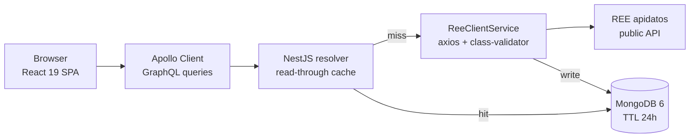

#### 🧠 Project Overview

Goal: turn the **public REE (`apidatos`) API** into a visualizer that
answers the questions a curious reader of the Spanish grid actually
asks — *where is the electricity coming from right now, how much are
we importing from Portugal, what share of the mix is renewable this
week, how is demand trending this month* — without forcing that reader
to scrape endpoints or write a single line of code.

Ree View is built on top of the open endpoints REE publishes:
generation by technology, system demand, international exchanges at
the France / Portugal / Andorra / Morocco borders and storage balance
(pumped hydro + batteries). The frontend ships a date-range picker
and an energy-type filter (renewable vs. non-renewable), and the
backend caches every REE response in MongoDB with a 24h TTL so a
heavy exploratory session never trips REE's rate limits.

Current features:

- **Date-range filter** through `react-datepicker`, with validation on
  both ends so the GraphQL resolver never sees a malformed range.
- **Generation breakdown by technology** — eólica, solar fotovoltaica,
  hidráulica, nuclear, gas natural, carbón y resto — with totals and
  percentage share, rendered as a stacked `recharts` `BarChart`.
- **Average system demand** plotted across the selected window.
- **Cross-border exchanges** at all four Iberian borders, signed
  positive for import and negative for export, with a small dashboard
  card per neighbour.
- **Storage balance** for pumped hydro and batteries
  (charge / discharge).
- **Light / dark theme** via design tokens, with no flash of
  unstyled content on first paint.

#### 🏗️ Architecture: Read-Through GraphQL on Top of REE

The runtime is two apps wired together over GraphQL — a Vite SPA on
the browser side and a NestJS resolver layer in front of the public
REE API on the server side — plus a MongoDB instance that fronts REE
as a read-through cache.



This shape lets us:

- Treat REE as a swappable upstream by replacing `ReeClientService`
  with another HTTP client — every resolver goes through that one
  seam.
- Turn the cache TTL into a knob (`THROTTLE_TTL_MS`) without touching
  any code — the read-through logic lives in the resolver decorator.
- Stand up the entire stack with a single `docker-compose up` —
  backend, frontend and Mongo come up together with healthchecks and
  a pre-warmed Mongo volume.
- Iterate on the React side against a mocked backend in dev by
  flipping one env var, so the UI loop never blocks on the public
  API.

#### 🧰 Technologies Used

⚛️ Frontend (`frontend/`)

- **React 19** with concurrent rendering to keep the chart-heavy
  dashboard responsive on long date ranges.
- **Vite 6** for the dev server and the production build — the hot
  reload on the GraphQL contract is the iteration loop that matters
  most.
- **TypeScript** end-to-end, with generated GraphQL types feeding
  directly into component props.
- **Apollo Client** as the GraphQL client, with a single `HttpLink`
  pointed at the backend endpoint.
- **Tailwind CSS 4** with design tokens that theme light and dark
  mode without a runtime CSS-in-JS layer.
- **recharts** for the responsive `BarChart` / `LineChart` rendering
  of generation, demand and exchange series.
- **react-datepicker** for the date-range input, with validation
  hooks bound to the resolver contract.

🔙 Backend (`backend/`)

- **NestJS 10** as the application framework — modules, DI,
  decorators and lifecycle hooks line up 1:1 with the GraphQL surface
  area.
- **GraphQL (Apollo Server)** as the single contract between the
  frontend and the backend — no REST routes to keep in sync.
- **Mongoose** as the ODM over **MongoDB 6** for the response cache.
- **Axios** as the HTTP client against the REE endpoints.
- **@nestjs/throttler** as a global rate-limit guard on the GraphQL
  layer, sized so a heavy exploratory session never crosses the
  upstream's public API limits.
- **class-validator** + **class-transformer** for input shape
  validation on every resolver argument.

#### 🔐 Key Technical Decisions

✅ 1. GraphQL as the contract, REST as the upstream

REE exposes REST endpoints whose shape changes per category.
Wrapping them behind a single GraphQL resolver layer means the React
client queries a stable contract — `generation(range, type)`,
`demand(range)`, `exchanges(range)`, `storage(range)` — while the
backend absorbs every change in the upstream JSON into a small
adapter. If REE retires an endpoint tomorrow, only `ReeClientService`
moves.

✅ 2. MongoDB read-through cache with a 24h TTL

The public REE API caps well below the requests-per-second a
visualizer naturally produces (every filter change is a new query).
The backend caches every successful response in a `responses`
collection with a TTL index that expires documents after 24h, so the
steady-state cost on REE drops from "every page interaction" to
"one query per (endpoint, day)".

✅ 3. `@nestjs/throttler` to protect the upstream

The cache hides the *hot* case; `@nestjs/throttler` on the resolver
layer hides the *cold* and *abuse* cases. Together they keep the
project well within REE's public API limits without sacrificing
responsiveness on the frontend.

✅ 4. The smoke test is end-to-end possible because of the healthchecked Compose stack

The **6-phase end-to-end contract** exercised by `verify-stack.sh`
(covered under `📦` above) only works because the 3-service Compose
file gates its startup ordering on healthchecks — without that gate,
CI would happily see `up --build` as "running" before the backend had
finished booting, and the smoke test would lie.

#### 📦 Infrastructure and Deployment

The whole stack ships as a 3-service Docker Compose file, and the
same stack can also be brought up locally with two `pnpm dev`
terminals for hot reload on each side.

- **`docker-compose.yml`** orchestrating three services — `backend`
  (NestJS), `frontend` (Vite build served by Nginx), `mongo`
  (MongoDB 6 with a persistent volume, DB `energy-balance`) — with
  healthchecks pinning startup ordering so `docker-compose up -d
  --build` always converges on a queryable stack, not one half up.
- **Frontend served by Nginx** inside the `frontend` container at
  `http://localhost:80`, with a reverse-proxy pass to the backend's
  `/graphql` endpoint on the same Compose network.
- **Configurable via env**: `CORS_ORIGINS` whitelist for the
  GraphQL resolver, `MONGODB_URI` for the database (defaults to the
  in-stack `mongo` container), `THROTTLE_TTL_MS` /
  `THROTTLE_LIMIT` for the global rate-limit, `VITE_API_URL`
  injected at build time pointing the SPA at the backend.
- **Smoke test**: a `verify-stack.sh` script exercises the **6
  end-to-end phases** (stack-up, the three GraphQL resolvers,
  rate-limiting and the Mongo TTL expiry) — useful as a sanity
  check after every change to the contract.

**Local dev** (two terminals, hot reload on both ends):

```bash
# backend
cd backend
cp .env.example .env   # tune REE_API_URL, MONGODB_URI, CORS_ORIGINS
pnpm install
pnpm run dev           # http://localhost:3000/graphql

# frontend, in a second terminal
cd frontend
cp .env.example .env   # VITE_API_URL=http://localhost:3000/graphql
pnpm install
pnpm run dev           # http://localhost:5173
```

**Full stack with Docker** (one command):

```bash
docker-compose up -d --build
# Frontend  → http://localhost:80           (Nginx → Vite bundle)
# Backend   → http://localhost:3000/graphql (GraphQL Playground)
# MongoDB   → mongodb://localhost:27017     (DB: energy-balance)
```

#### 📈 Current Outcome

✔️ Full-stack visualizer deployable with a single
`docker-compose up` and queryable end-to-end through GraphQL.

✔️ Read-through cache keeps public-REE traffic flat under heavy
exploratory sessions, with a 24h TTL knob tunable via env.

✔️ Smoke test passing the 6 end-to-end phases — stack-up, every
resolver and the rate-limit guard.

✔️ Frontend usable against a mocked backend in dev so the UI loop
never blocks on the public API.

#### 📎 Conclusion

Ree View shows that a public, real-time data source can power a
production-shaped data product without taking on any cloud
dependencies: one NestJS graph in front of REE, one MongoDB
collection acting as a cache, one Vite SPA reading the contract, and
one Compose file holding them together.

The architectural decisions — GraphQL as the single contract, a
read-through cache with TTL, a throttler on the resolver layer, and a
Compose healthcheck-pinned stack — were driven less by novelty than
by the simple rule that *the public REE API should not feel like the
bottleneck of the visualization*.

Want to read the source or run it locally with your own REE API
credentials?

- 🔗 [Repository](https://github.com/alkiory/ree-view/)

-🔗 [Live demo](https://alkiory.github.io/ree-view/)