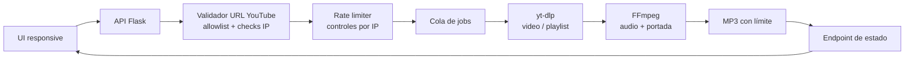

#### 🧠 Visión general del proyecto

YouTube Audio Downloader es una herramienta enfocada en un flujo común de
escucha offline: pegar una URL de YouTube permitida, elegir un video o una
playlist y obtener audio MP3 con la portada de origen incrustada. La
experiencia de usuario se mantiene pequeña a propósito, pero los detalles
operativos reciben el mismo cuidado que una aplicación de producción:
descargas largas, validación de entradas, límites de recursos, rate limiting
y hardening del contenedor forman parte del diseño, no son parches de última
hora.

Admite videos individuales y playlists de hasta 50 elementos. Cada descarga
se inicia como un job y el navegador consulta su estado hasta que el archivo
está listo. Este modelo evita que un proceso largo de `yt-dlp` bloquee la
petición HTTP inicial y le da a la UI un lugar claro para comunicar progreso,
reintentos y errores del upstream.

Es una herramienta autoalojable, no un downloader público hospedado. El
repositorio también documenta una realidad importante del despliegue:
YouTube puede desafiar requests provenientes de IPs de datacenter aunque la
misma aplicación funcione localmente desde una conexión residencial. La
implementación no intenta esconder ni evadir esa restricción; la deja clara
y recomienda mantener `yt-dlp` actualizado.

#### ✨ Funcionalidades principales

- **Conversión a MP3 de alta calidad** usando FFmpeg e incrustando la
  portada del medio de origen cuando está disponible.
- **Soporte de playlists** limitado por defecto a 50 videos, con un límite
  configurable para proteger el host de jobs accidentales demasiado grandes.
- **Jobs de descarga asíncronos** consultables mediante
  `/api/download/<job_id>`, para que el navegador siga el trabajo sin
  mantener abierta la petición original.
- **Interfaz responsive** para escritorio y móvil, con manejo amigable de
  respuestas `429` y cabeceras `Retry-After`.
- **Controles de recursos configurables** para workers concurrentes,
  timeouts, tamaño de fuente, bitrate y directorio de descargas.
- **Despliegue Docker-first** con Compose listo para usar y un repositorio
  publicado en Docker Hub para instalaciones basadas en imágenes.

#### 🏗️ Arquitectura: request, job y pipeline multimedia

El servicio es una aplicación Flask pequeña con una frontera explícita entre
la validación de requests, el trabajo de descarga en segundo plano y la
entrega de archivos.



El flujo está diseñado alrededor de límites claros:

- **El navegador nunca ejecuta el downloader.** Envía una URL a la API y
  recibe un identificador de job; el backend controla la extracción, la
  conversión y la limpieza.
- **La validación ocurre antes de programar trabajo.** La URL debe
  pertenecer a un dominio de YouTube permitido y se comprueba contra rangos
  privados, loopback, link-local, reservados y CGNAT para reducir el riesgo
  de SSRF.
- **El endpoint de jobs se puede consultar.** El polling de estado usa el
  límite por defecto en lugar del límite más estricto de descargas, así una
  conversión larga puede seguirse una vez por segundo sin agotar la cuota.
- **Los límites de salida se aplican en el borde.** Tamaño de archivo,
  timeout, tamaño de playlist y workers concurrentes evitan convertir una
  instalación autoalojada en una cola de procesamiento sin control.

#### 🧰 Tecnologías utilizadas

🐍 **Backend y procesamiento multimedia**

- **Python 3.11+** ejecutando una aplicación web Flask y su API.
- **yt-dlp** para extraer medios de videos y playlists de YouTube permitidos.
- **FFmpeg** para convertir audio e incrustar metadatos y portada.
- **Flask-Limiter**, con soporte opcional para Redis, para límites por IP
  configurables por hora y por día.
- Un flujo de jobs basado en filesystem para archivos terminados y salidas
  temporales de procesamiento.

🐳 **Empaquetado y operaciones**

- **Docker** con una imagen de runtime mínima, usuario no-root y capacidades
  de Linux eliminadas.
- **Docker Compose** para levantar el stack local con un único comando en el
  puerto 5000.
- Variables de entorno como `MAX_PLAYLIST_SIZE`,
  `MAX_DOWNLOADS_PER_HOUR`, `MAX_DOWNLOADS_PER_DAY`,
  `MAX_CONCURRENT_DOWNLOADS`, `DOWNLOAD_TIMEOUT`, `BITRATE` y
  `MAX_FILE_SIZE_MB`.
- Tests de Python para validación de URLs, routing de playlists, rate
  limiting, opciones de procesamiento y endpoints de descarga.

#### 🔐 Seguridad desde el diseño

✅ **Protección contra SSRF**

El validador usa una allowlist de dominios de YouTube y valida resoluciones
IPv4 e IPv6. Los rangos privados, loopback, link-local, reservados y CGNAT
generados como documentación son rechazados antes de que un proceso de
descarga pueda acceder a ellos.

✅ **Seguridad de entradas y filesystem**

Las URLs se validan antes de procesarse, los nombres de archivo se sanitizan
para prevenir path traversal, los tamaños de entrada y salida tienen límites
y la API devuelve errores genéricos en lugar de exponer stack traces internos.

✅ **Prevención de XSS**

Los valores dinámicos se renderizan mediante APIs seguras del DOM y
`textContent`, no mediante inyección de HTML crudo. Esto es especialmente
importante en una herramienta multimedia porque títulos, canales y metadata
provienen de fuera de la aplicación.

✅ **Hardening del contenedor**

La imagen Docker corre como usuario no-root, elimina todas las capabilities y
habilita `no-new-privileges`. El runtime se mantiene pequeño para que la
superficie de ataque sea acotada e inspeccionable.

✅ **Controles contra abuso**

Los límites por hora y día por IP, el máximo de playlist, el número de
workers concurrentes y los timeouts hacen visible y ajustable el costo
operativo. El rate limiting está desactivado por defecto en desarrollo local
y debe habilitarse explícitamente en despliegues online, donde
`render.yaml` lo activa.

#### 🚀 Ejecútalo con Docker

El repositorio está preparado para levantar un deployment local con Compose:

```bash
git clone https://github.com/alkiory/downloader-yt.git
cd downloader-yt
docker-compose up -d
```

Después abre `http://localhost:5000`. Puedes ajustar los límites en un
archivo `.env`, inspeccionar el servicio con `docker-compose logs -f` y
reconstruirlo con `docker-compose build --no-cache` cuando cambien la imagen
o las dependencias.

La imagen publicada también está disponible en Docker Hub para quienes
prefieren descargar una imagen en lugar de construir desde el código fuente.
Usa siempre la herramienta únicamente con contenido que tengas permiso de
descargar y cumple los Términos de Servicio de YouTube y la legislación
aplicable.

#### 🧪 Verificación y manejo de fallos

La suite de tests del backend cubre las áreas con mayor riesgo de regresión
en una herramienta de este tipo:

- Allowlist de URLs y rechazo de redes privadas.
- Routing entre videos y playlists.
- Comportamiento del rate limiter y sus límites configurables.
- Opciones seguras de descarga y procesamiento multimedia.
- Endpoints de descarga y estado de jobs asíncronos.

El navegador también respeta `Retry-After` en respuestas `429`, reanuda el
polling cuando corresponde y muestra errores genéricos sin revelar detalles
de implementación. Así las restricciones del upstream y los límites locales
se entienden, en vez de parecer fallos aleatorios.

#### 📈 Resultado actual

✔️ Flujo completo Flask + yt-dlp + FFmpeg para extraer audio permitido,
con soporte para videos individuales y playlists.

✔️ API basada en jobs que se mantiene responsive mientras se procesan
descargas largas.

✔️ Controles de seguridad frente a SSRF, XSS, path traversal, abuso de
rate, agotamiento de recursos y privilegios del contenedor.

✔️ Despliegue Docker reproducible mediante Compose y una imagen publicada
en Docker Hub, con configuración documentada para entornos locales y online.

#### 🔗 Empieza aquí

¿Listo para revisar el código o levantar el contenedor?

- 🐳 **[Descargar la imagen desde Docker Hub](https://hub.docker.com/repository/docker/iamsergiocampbell/downloader-yt/general)**
- 💻 **[Leer el código y la documentación de seguridad en GitHub](https://github.com/alkiory/downloader-yt)**

Usa Docker Hub si quieres el camino más corto hacia una instalación local
repetible. Usa GitHub si quieres revisar el validador, el flujo de jobs, la
suite de tests o las decisiones de hardening antes de construir tu propia
imagen.

##### 🧠 ¿Estás construyendo una utilidad autoalojable?

Si estás empaquetando una herramienta multimedia, de automatización o de
procesamiento de datos para ejecutarla de forma confiable y quieres hablar
de jobs, límites de recursos o seguridad de contenedores, escríbeme sin
compromiso 🚀

> **Aviso legal:** Este proyecto está pensado para uso personal. Descargar
> contenido de YouTube puede violar sus Términos de Servicio. Eres responsable
> de contar con los derechos necesarios y de cumplir la legislación aplicable;
> no descargues ni distribuyas material con copyright sin permiso.
