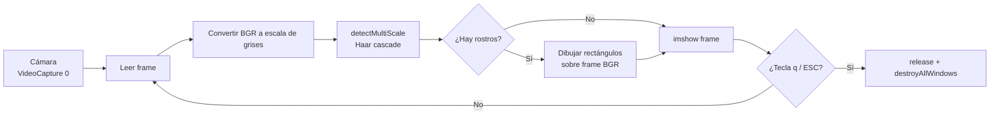

#### 🧠 Visión general del proyecto

Objetivo: un script de Python autónomo, en un solo archivo, que
convierta cualquier webcam de laptop o USB en un detector de
rostros en vivo — útil como punto de partida para sistemas de
asistencia, demos de presencia, material de onboarding en
visión por computadora y cualquier otro lugar donde "¿hay una
cara en este frame ahora mismo?" sea lo único que haya que
responder.

Se mantiene deliberadamente pequeño: sin frameworks de deep
learning, sin descarga de datasets, sin GPU. El script corre
sobre el clasificador Haar cascade de OpenCV que viene con la
biblioteca, así que es clonar-y-correr en cualquier máquina con
Python 3 y una cámara funcionando.

Funcionalidades actuales:

- Abre la cámara por defecto con `cv2.VideoCapture(0)` y lee
  frames en un `while True` ajustado.
- Convierte cada frame BGR a escala de grises antes de la
  inferencia — Haar cascades sólo operan sobre imágenes de
  una sola canal de intensidad, y saltarse esta conversión es
  la fuente más común de falsos negativos para quienes lo
  prueban por primera vez.
- Ejecuta `detectMultiScale(...)` con valores conservadores de
  `scaleFactor` y `minNeighbors` para que el detector prefiera
  pocas cajas de alta confianza por sobre muchas cajas ruidosas.
- Dibuja un rectángulo por cada rostro detectado directamente
  sobre el frame BGR, así el usuario ve el *stream* de color
  original, no la copia de trabajo en escala de grises.
- Libera la cámara limpiamente con `q` o `ESC` para que el SO
  no quede con el dispositivo bloqueado después de cerrar la
  ventana.

#### 🏗️ Arquitectura: pipeline en bucle de frames

El script entero es un pipeline secuencial: capturar →
preprocesar → detectar → anotar → mostrar → repetir. No hay
estado entre iteraciones más allá del propio clasificador en
cascada, lo que mantiene el programa fácil de razonar y fácil de
envolver en un test unitario que reemplace la cámara por un
archivo de video.

Esta forma nos permite:

- Tratar a la cámara como una entrada intercambiable
  reemplazando `VideoCapture(0)` por
  `VideoCapture("input.mp4")` para testing offline sin tocar
  el código aguas abajo.
- Reutilizar la conversión a escala de grises como costura
  natural para cualquier paso futuro de ecualización de
  histograma o normalización CLAHE.
- Frenar el bucle con una sola condición de corte, sin riesgo
  de dejar el dispositivo de cámara bloqueado cuando el usuario
  cierra la ventana.

#### 🧰 Tecnologías utilizadas

🐍 Runtime / bibliotecas

- **Python 3** como lenguaje de scripting — elegido para que
  el script pueda editarse en vivo y re-ejecutarse sin paso de
  compilación.
- **OpenCV (`cv2`)** como única dependencia para I/O de
  cámara, conversión de color, carga de cascadas, detección,
  dibujo y ventana de display.
- **Haar Cascade Classifier** (el
  `haarcascade_frontalface_default.xml` pre-entrenado que
  viene con OpenCV) como detector. Amigable con CPU,
  determinista y suficientemente bueno para rostros frontales
  en escenas interiores bien iluminadas.
- **NumPy** (en forma transitiva, vía OpenCV) para el buffer
  por-frame que respalda las vistas BGR y escala de grises.

🛠️ Tooling

- **pip** para instalar dependencias
  (`pip install opencv-python`).
- Cualquier editor estándar — el script es un único archivo
  Python sin scaffolding de proyecto.

#### 🔐 Decisiones técnicas clave

✅ 1. Haar cascades en lugar de un detector DNN

Los detectores de rostros DNN (YuNet, RetinaFace, MediaPipe) son
más precisos, pero todos ellos arrastran un archivo de modelo
más un runtime tipo ONNX, MediaPipe o intérprete de TF Lite.
Para un script cuya propuesta de valor es "clonar, instalar,
correr", las Haar cascades bajan la vara lo suficiente como para
que un lector sin background en ML pueda mapear el código línea
por línea.

✅ 2. Cámara por defecto como fuente de entrada

`cv2.VideoCapture(0)` funciona en cualquier laptop y en cualquier
webcam USB que se registre como `/dev/video0`. No hay flag de
CLI que configurar, no hay path de dispositivo que adivinar. La
primera ejecución "simplemente funciona" en el hardware más
común.

✅ 3. Entregable de un solo archivo

Sin `requirements.txt`, sin layout de paquete, sin entry-point.
El repositorio es el archivo. El trade-off es que escalar más
allá de un demo (logging, múltiples cámaras, modo headless)
requeriría reestructurar — pero no es lo que el script busca.

#### 📈 Resultado actual

✔️ Script autónomo que corre en una instalación limpia de Python
con un único `pip install`.

✔️ Detección de rostros en tiempo real a velocidades de frame
interactivas en una laptop CPU, sin necesidad de GPU.

✔️ Camino de salida limpio: el dispositivo de cámara siempre se
libera al salir — sin sorpresas del estilo "el LED queda
encendido después de Ctrl+C".

✔️ Listo como base de aprendizaje: cambiar la cascada por una
DNN, cambiar la cámara por un archivo de video o envolver el
bucle en un endpoint Flask — el enmarcado del pipeline hace
que cualquiera de estos sea un cambio localizado.

#### 📎 Conclusión

La detección de rostros en tiempo real es un "hola mundo" con
una webcam: suficientemente pequeño para caber en un archivo,
suficientemente grande como para mostrar cada concepto que un
proyecto de CV posterior reusará — captura de dispositivo,
preprocesamiento, inferencia, anotación y apagado limpio.
Mantener la superficie tan chica es lo que vuelve al script un
artefacto útil para enseñar: el lector puede mantener todo el
programa en la cabeza y luego ir sustituyendo las piezas una por
una.

¿Querés leer el código fuente o forkearlo como punto de partida
para tu propio detector?

- 🔗 [Repositorio](https://github.com/SergioCampbell/faceReconition)

##### 🧠 ¿Trabajás en un pipeline de CV similar?

Si estás escalando esto a captura multi-cámara, despliegue
headless o un detector DNN y querés charlar sobre los
trade-offs, escribime sin compromiso 🚀
