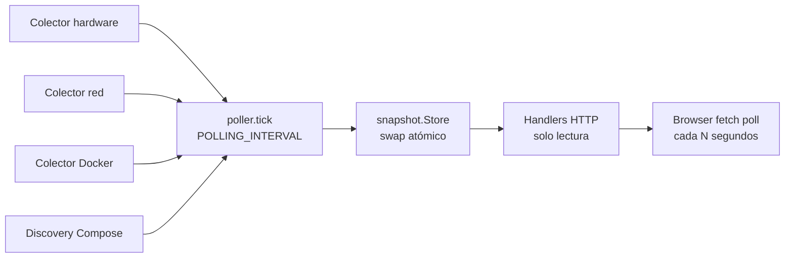
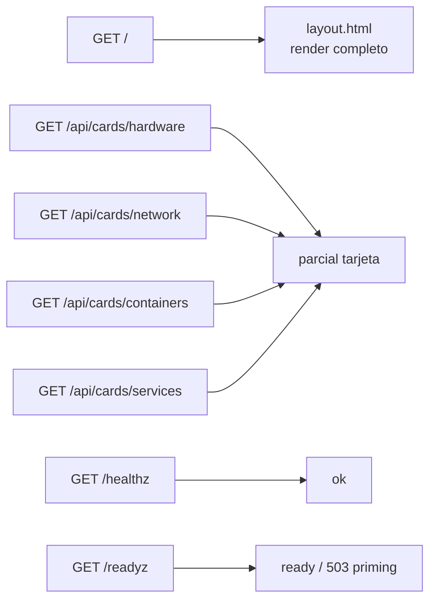
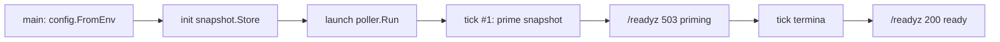

#### 🧠 Visión general del proyecto

Objetivo: darle a un host de home lab una sola página que responda
las cuatro preguntas que le hago seguido — *¿el host está vivo?,
¿la red está viva?, ¿mis contenedores están sanos?, ¿qué estoy
corriendo al final?* — y nada más que eso. Sin históricos, sin
alertas, sin flota de agentes.

Funcionalidades actuales:

- Cuatro tarjetas auto-refrescantes: **Hardware** (CPU, memoria,
  swap, discos, temperatura opcional), **Red** (interfaces, estado
  del enlace, direcciones, throughput, IP pública), **Contenedores**
  (estado, health, CPU/memoria, start/restart/stop inline) y
  **Servicios** (proyectos Compose con etiquetas de metadata).
- Servicio Go autoalojado de un solo binario, sin SPA, sin base
  de datos, sin dependencias de terceros en el navegador.
- Docker se trata como opcional — si el daemon desaparece, la
  tarjeta de Contenedores conserva el último listado bueno y lo
  marca como obsoleto en lugar de quedar en blanco.
- Variables de entorno configurables para cadencia de polling,
  puerto expuesto, título, log level, toggle de IP pública y los
  paths de scan de Compose a recorrer.

#### 🏗️ Arquitectura: Snapshot + Poller

El runtime es un único goroutine de trabajo más un swap atómico y
una capa HTTP de solo lectura encima.

<!-- canonical: ../snippets/architecture-es.md -->

Esta estructura nos permite:

- Mantener el único estado mutable compartido en un solo lugar —
  `snapshot.Store` — protegido por un único escritor (el poller).
- Renderizar las respuestas HTTP desde un snapshot inmutable
  construido fresco en cada tick; los handlers nunca llaman
  directamente a Docker, `/proc` ni a servicios externos de IP.
- Recuperarnos con gracia frente a una caída de Docker: el último
  listado bueno de contenedores se queda en el snapshot y se
  re-renderiza con un badge de obsoleto.
- Esperar limpios los arranques en frío: `/readyz` retorna
  `503 priming` hasta que el primer tick termina, así un proxy
  reverso puede retener los health checks sin servir jamás una
  página medio inicializada.

#### 🧰 Tecnologías utilizadas

🔙 Backend (Go standard library)

- Go 1.25 con `net/http`, `html/template`, `embed.FS` y
  `log/slog` de la stdlib. Sin framework web, sin motor de
  plantillas, sin sidecar de assets.
- `gopsutil/v3 v3.24.5` para métricas de hardware (CPU, memoria,
  swap, disco, uptime) y red (counters de interfaces, direcciones).
- Docker SDK `v25.0.6+incompatible` para estado, health y stats
  one-shot de contenedores — leído a través de un socket proxy
  TCP, nunca el socket crudo.
- `gopkg.in/yaml.v3 v3.0.1` para el scanner de archivos Compose
  (`compose.yml`, `compose.yaml`, `docker-compose.yml`,
  `docker-compose.yaml`, profundidad 3, symlinks saltados).

🎨 Frontend (JavaScript vanilla + CSS artesanal)

- Un template HTML (`layout.html`) más cuatro parciales de tarjeta
  en `web/templates/partials/`.
- CSS escrito a mano en `web/static/css/app.css`.
- JavaScript vanilla en `web/static/js/app.js`: un pequeño poller
  basado en `setInterval` que llama a los cuatro endpoints
  `/api/cards/*` con `fetch()` y reemplaza el innerHTML de cada
  tarjeta.
- Sin React, sin HTMX, sin framework, sin paso de build.

#### 📦 Infraestructura y despliegue

- `Dockerfile` multi-stage: builder con Go 1.25, runtime
  `alpine:3.20` con assets embebidos y un usuario no-root
  `appuser`. Imagen final alrededor de 22 MB comprimida;
  memoria residente por debajo de 50 MB.
- `docker-compose.yml` corriendo a través de
  `tecnativa/docker-socket-proxy` para que el dashboard nunca
  toque `/var/run/docker.sock` directamente. El mount de scan
  de Compose es read-only
  (`/home/alkiory/projects:/projects:ro`).
- Red: `npm_network` externa compartida con el resto del
  homelab, igual que Nginx Proxy Manager.
- Sin almacenamiento persistente, sin migraciones, un contenedor
  sin volúmenes por host.

#### 🌐 Navegación de usuario y flujos

<!-- canonical: ../snippets/user-navigation-es.md -->

🧭 Secuencia de arranque en frío:

<!-- canonical: ../snippets/cold-start-es.md -->

#### 🔐 Decisiones técnicas clave

✅ 1. Snapshot + Poller en lugar de llamadas directas en los
handlers

La primera versión ataba las llamadas al Docker SDK directo en
los handlers HTTP. Cada refresh del navegador pegaba al socket
proxy al 100% CPU. Mover la recolección a un único goroutine que
hace swap atómico de `snapshot.Snapshot` redujo la RSS de saturada
a menos de 50 MB y eliminó el parpadeo.

✅ 2. Docker es invitado del host, no amigo

El dashboard habla con Docker solo a través de un socket proxy
TCP (`tecnativa/docker-socket-proxy`). Montar
`/var/run/docker.sock` directamente significaría que un bug en el
dashboard es un bug en el host; el socket proxy mantiene esa
superficie angosta e inspeccionable.

✅ 3. Las cuatro tarjetas son toda la superficie de features

Una vista de históricos, un pipeline de alertas y una flota de
agentes están fuera del alcance. Un home lab no necesita Datadog;
necesita la única pestaña del navegador que dejas abierta.

#### 📊 Visualización de datos y contenido de las tarjetas

Cada tarjeta lee directo del snapshot. No hay
"dashboard-as-config" — las tarjetas tienen forma fija y el
poller decide qué las llena.

- **Hardware:** modelo y utilización de CPU, uso de memoria y
  swap, uso por disco filtrando filesystems virtuales, hostname,
  OS, uptime. Temperatura desde `/sys/class/thermal/*` en Linux
  cuando es legible desde adentro del contenedor.
- **Red:** counters por interfaz, estado up/down actual desde
  `/sys/class/net/*/operstate`, direcciones del enlace y tasas
  de bandwidth diffadas contra el tick previo. IP pública
  cacheada por 60 segundos y desactivada con
  `ENABLE_PUBLIC_IP=0`.
- **Contenedores:** listado con estado, health y el último
  snapshot de CPU/memoria observado. Botones
  `start`/`restart`/`stop` inline; el server enforces un timeout
  de 20 segundos por acción.
- **Servicios:** proyectos Compose descubiertos desde las raíces
  de scan configuradas, con metadata tomada de las etiquetas
  `dashboard.*` / `homelab.*`. Solo URLs `http:` y `https:` se
  renderizan como links.

#### 📈 Resultado actual

✔️ Servicio de un solo binario en producción en varios hosts de
home lab.

✔️ Path de cold-start verificado end-to-end — el Docker
socket-proxy está listo antes de que `/readyz` retorne `200`.

✔️ Contrato de outages verificado: reinicios del daemon de Docker
no dejan en blanco la tarjeta de Contenedores; si el proxy se cae,
se recupera sin reiniciar el dashboard.

✔️ Build reproducible: `go build .` desde Go 1.25 reproduce el
binario byte-a-byte contra el lockfile versionado.

#### 📎 Conclusión

hm-dashboard demuestra que se puede auto‑hospedar una sola página
que cubre las cuatro preguntas que un home lab realmente recibe,
con un solo binario Go, sin SPA, sin base de datos y con un
contrato Docker-como-opcional que se mantiene incluso cuando
Docker es justo lo que se está monitoreando.

Las decisiones arquitectónicas — un único goroutine para la
recolección de datos, swap atómico del snapshot, handlers HTTP
de solo lectura, front-end en JS vanilla, detrás de un socket
proxy TCP — fueron impulsadas menos por la novedad que por la
regla simple de que *la tarjeta que se queda en blanco cuando
Docker hace plop es exactamente la que más necesitabas*.

¿Querés leer el código fuente o correrlo en tu propio home lab?

- 🔗 [Repositorio](https://github.com/alkiory/hm-dashboard)

##### 🧠 ¿Te interesa un stack similar?

Si estás armando tu propio dashboard de home lab y querés hablar
del contrato de "el poller es el único escritor" o de la
convención de etiquetas de Compose, escribime sin compromiso 🚀
