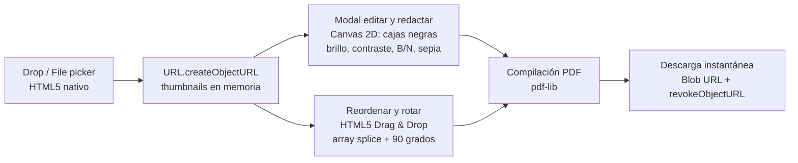
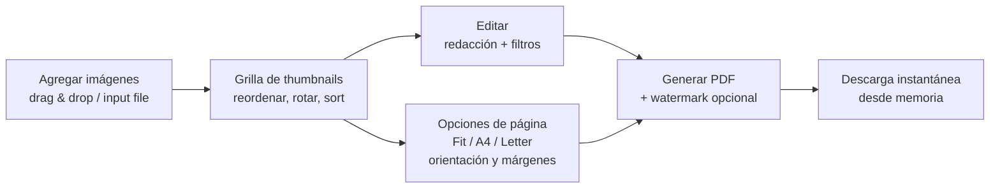

#### 🧠 Visión general del proyecto

¿Alguna vez subiste una foto de tu DNI o un documento bancario a un
convertidor online de "Imagen a PDF"? La mayoría de nosotros lo hizo,
pero la realidad es incómoda: no sabemos en qué servidores terminan,
si se almacenan copias temporales o qué tan anónimos son realmente
esos servicios.

Con esa inquietud en mente construí mi propia solución y aproveché
para poner en práctica un principio clave: **el diseño de sistemas
guiado estrictamente por casos de uso y simplicidad (YAGNI)**.

Funcionalidades actuales:

- **100% cliente y privado:** las imágenes nunca salen del
  dispositivo. Funciona completamente offline.
- **Drag & Drop nativo:** subida y reordenado de thumbnails con la
  API HTML5 Drag & Drop, sin librerías.
- **Editor y redacción en cliente:** cajas negras sobre información
  sensible (DNI, direcciones, rostros) y filtros ajustables
  (brillo, contraste, B/N, sepia).
- **Marca de agua en mosaico:** estampado diagonal repetido en
  todas las páginas.
- **Opciones de página:** ajustar a la imagen, A4 o US Letter en
  orientación vertical, horizontal o auto, con márgenes
  personalizables.
- **Zero build step:** HTML5, CSS3 y JavaScript puro con pdf-lib.

#### 💡 La tentación inicial vs. la decisión real

Al principio, la inercia típica de desarrollo invita a montar:

- ❌ Backend en FastAPI + Docker
- ❌ Daemons y cron jobs para limpiar archivos temporales en disco
- ❌ Frontend con React/Preact + librerías pesadas de drag & drop +
  Tailwind
- ❌ Pipelines de build complejos (Vite/Webpack)

¿Pero realmente el caso de uso necesita un servidor? La respuesta
fue **NO**. Antes de escribir código, audité la arquitectura
propuesta contra el caso de uso y eliminé o reemplacé cada capa que
no aportaba:

| Componente propuesto | Decisión | Por qué |
| :--- | :--- | :--- |
| FastAPI + Uvicorn | **Eliminado** | Procesar en memoria en el navegador elimina costos, latencia, transferencia de red y fugas de datos en el servidor. |
| Storage temporal + daemons de limpieza | **Eliminado** | La RAM del navegador maneja los byte streams sin I/O de disco ni race conditions. |
| Docker y hosting en la nube | **Eliminado** | La app estática corre en GitHub Pages o vía `file:///` a $0/mes. |
| Preact + react-dropzone + dnd-kit | **Reemplazado por HTML5 nativo** | `<input type="file" multiple>`, `<label for="...">` y la API nativa de Drag & Drop reemplazaron 200 MB+ de `node_modules`. |
| Tailwind + bundlers | **Reemplazado por CSS vanilla** | CSS moderno con variables, flexbox y grid elimina todo pipeline de build. |
| Jest / test runner de Node | **Reemplazado por runner in-browser** | `test.html` valida generación de PDF, orden, watermarks y filtros de canvas directamente en cualquier navegador. |

#### 🏗️ Arquitectura: dos archivos estáticos

El resultado es una aplicación de **dos archivos estáticos**
(`index.html` + `pdf-lib.min.js`), desplegable en GitHub Pages con
escalabilidad infinita, privacidad máxima y cero mantenimiento.

El pipeline en detalle:

1. **Ingesta:** el input nativo y los eventos de drag & drop leen
   los objetos `File`, les asignan IDs aleatorios y object URLs
   livianos. Nada toca un disco ni un servidor.
2. **Redacción y edición en cliente:** al editar, la imagen se
   renderiza en un canvas offscreen. El usuario dibuja rectángulos
   negros para tapar texto sensible; las redacciones y los ajustes
   de color se renderizan a un stream JPEG del canvas.
3. **Reordenado y estado:** las tarjetas usan eventos nativos de
   drag (`dragstart`, `dragover`, `drop`) para reordenar el array
   de ítems en memoria.
4. **Generación de PDF (`pdf-lib`):** embedding directo y sin
   pérdidas para JPEG/PNG sin editar (preserva la fidelidad
   original y evita re-encoding); imágenes rotadas, filtradas o
   redactadas pasan por la Canvas 2D API. Los cálculos de escala
   ajustan el aspect ratio al tamaño de página elegido (ajustar a
   imagen, A4, US Letter) y márgenes. Si se pide watermark,
   `StandardFonts.HelveticaBold` se estampa en una grilla diagonal
   repetida en toda la página.
5. **Export sin servidor:** el byte array compilado se envuelve en
   un `Blob`, se attacha a un anchor efímero, se dispara la
   descarga y se limpia de memoria con `URL.revokeObjectURL`.

#### 🔐 Decisiones técnicas clave

✅ 1. 0 bytes transferidos

Las imágenes se procesan en la memoria RAM del navegador. Privacidad
total, latencia cero y compatible offline. El caso de uso —
convertir documentos sensibles — es exactamente el peor escenario
posible para subir bytes a un tercero.

✅ 2. HTML5 nativo en lugar de node_modules

La Canvas 2D API, el Drag & Drop nativo y `<input type="file">`
sustituyeron a cientos de megabytes en dependencias. El único
artefacto externo es `pdf-lib.min.js`, servido localmente junto al
HTML.

✅ 3. La redacción es un feature de privacidad, no de diseño

Poder tapar datos sensibles con cajas negras *antes* de generar el
PDF es parte del mismo contrato de privacidad: la edición nunca
toca la imagen original ni sale del navegador.

✅ 4. Infraestructura $0/mes

Sin backend, sin contenedores, sin cron jobs, sin pipelines. Toda la
operación es un GitHub Pages (o abrir `index.html` directo en el
navegador) y una suite de tests in-browser (`test.html`) que valida
PDFs, orden y watermarks sin dependencias de host.

#### 📊 Superficie de usuario

#### 📈 Resultado actual

✔️ App completa en producción en GitHub Pages — dos archivos
estáticos, cero pipeline.

✔️ Contrato de privacidad verificado por diseño: no existe
infraestructura de servidor que pueda almacenar nada.

✔️ Suite de tests automatizada corriendo in-browser (`test.html`)
sin runner de Node ni dependencias de host.

✔️ Compatible offline: una vez cargada, la página no necesita
conexión para nada.

#### 📎 Conclusión

A veces, la mejor arquitectura no es la que añade más capas o
microservicios, sino la que tiene la valentía de **eliminarlos**
cuando el caso de uso lo permite. imageToPdf demuestra que un
convertidor con edición, redacción, watermarks y control de páginas
no necesita más que HTML5 nativo y una librería cliente de PDF —
cero bytes transferidos, cero infraestructura, cero mantenimiento.

¿Querés probarlo o leer el código fuente?

- 🔗 [Repositorio](https://github.com/alkiory/imageToPdf)
- 🌐 [Demostración](https://alkiory.github.io/imageToPdf/)

##### 🧠 ¿Te interesa un enfoque similar?

Si estás evaluando si tu caso de uso realmente necesita un backend
(o querés hablar de YAGNI y simplificación agresiva de stacks),
escribime sin compromiso 🚀
