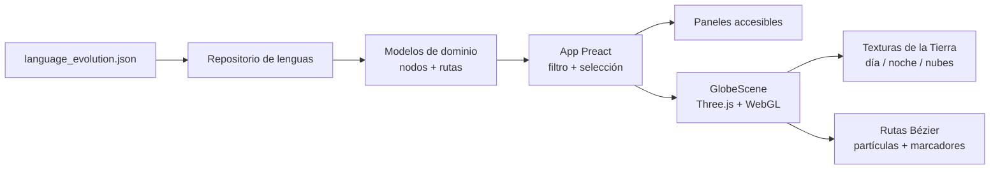

#### 🧠 Visión general del proyecto

Language History — *La Historia de Nuestra Voz* — nace de una pregunta
sencilla: **¿cómo convertir una historia compleja sobre lenguaje,
movimiento y cultura en algo que se pueda entender de un vistazo?**

En lugar de presentar el contenido como una línea de tiempo interminable
o un muro de texto, el proyecto sitúa la historia sobre una Tierra 3D
navegable. El globo relaciona los hitos históricos con las rutas
migratorias, mientras un panel educativo ofrece el contexto suficiente
para explorar cada punto sin abandonar la escena.

La aplicación es deliberadamente autocontenida. El dataset histórico
vive en `src/data/language_evolution.json`, la capa de dominio modela
nodos lingüísticos y rutas, y la capa visual recibe datos ya filtrados en
lugar de consultar el dataset directamente. Esta frontera mantiene la
experiencia rápida, predecible y fácil de ampliar con nuevos hitos o
grupos culturales.

#### ✨ Qué puedes explorar

- **Una Tierra 3D multicapa** con texturas diurnas, nocturnas, nubes y
  atmósfera para una sensación de profundidad mayor que la de un mapa
  convencional.
- **Ocho rutas migratorias animadas** trazadas con curvas de Bézier y
  partículas en movimiento, para que los desplazamientos se entiendan
  como recorridos y no como líneas estáticas.
- **Nueve hitos históricos** respaldados por un dataset JSON local y
  organizados mediante un filtro temporal con Paleolítico, Neolítico y
  dispersión, Historia y colonización, o la vista completa.
- **Paneles de detalle contextuales** con pestañas de resumen, cultura y
  contacto, y un archivo multimedia para el registro histórico asociado.
- **Referencias culturales externas** enlazadas a Wikimedia Commons, de
  modo que quien tenga curiosidad pueda continuar investigando sin
  duplicar un archivo completo dentro de la aplicación.
- **Una interfaz responsive y navegable con teclado**, con foco visible,
  roles ARIA y pestañas accesibles que siguen siendo útiles en pantallas
  pequeñas y grandes.

#### 🏗️ Arquitectura: datos de dominio y escena WebGL

La aplicación es un frontend estático construido con Vite. Preact se
encarga de la interfaz ligera alrededor del globo, mientras un componente
Three.js aislado controla el renderizado, la cámara, las rutas y la
atmósfera.



Esta separación aporta varias ventajas:

- **La escena está guiada por datos.** `GlobeScene` recibe datos de
  dominio filtrados y no conoce la forma en que la aplicación los guarda
  o selecciona.
- **El filtrado es económico.** El selector temporal trabaja sobre un
  dataset pequeño antes de pasarlo al renderer, en vez de pedirle a
  Three.js que decida qué objetos mostrar.
- **El frontend no necesita API ni base de datos.** La experiencia se
  puede cargar desde un CDN y cualquier colaborador puede cambiar el
  dataset sin levantar otro servicio.
- **Los recursos visuales son locales.** Las texturas de la Tierra y el
  archivo multimedia histórico viajan con el build, evitando problemas
  de hotlinking y CORS durante una presentación o una clase.

#### 🧰 Tecnologías utilizadas

🎨 **Presentación**

- **Preact** para la UI superpuesta, el estado de selección, las pestañas,
  la leyenda y los controles del filtro temporal con un bundle pequeño.
- **Three.js** directamente, sin una abstracción de escenas, para el
  globo, la cámara, la atmósfera tipo Fresnel, los marcadores, las curvas
  de Bézier y las partículas animadas.
- **Tailwind CSS v4** más estilos propios para el panel responsive, los
  controles, los estados de foco y la jerarquía visual.

🧭 **Dominio y tooling**

- **TypeScript en modo estricto** en las capas de dominio, datos y
  presentación, manteniendo explícitas las relaciones entre registros y
  rutas.
- **Vite** para desarrollo local rápido y un build estático de
  producción.
- Un **dataset JSON local** con nueve hitos y ocho rutas, acompañado de
  un pequeño repositorio que separa el acceso a los datos de la UI.
- **Firebase Hosting** sirviendo el directorio `dist/` generado, con
  rewrite para SPA, HTTPS y distribución mediante CDN.

#### 🎛️ Decisiones de interacción

✅ **Un globo en lugar de un mapa plano**

La vista esférica hace que la migración se sienta como movimiento sobre
un mismo planeta. Las texturas de día y noche, las nubes, las estrellas
y un parallax sutil aportan orientación sin convertir la interfaz en un
juego ni esconder el contenido educativo detrás de los efectos.

✅ **Filtrar por época antes de explorar**

El selector de eras permite comenzar con una parte manejable de la
historia. La vista completa sigue disponible, pero la primera interacción
no obliga a interpretar todas las rutas y todos los hitos al mismo tiempo.

✅ **Paneles en lugar de información solo al pasar el cursor**

El contexto importante no está escondido en un tooltip. Seleccionar un
marcador abre un panel estructurado con pestañas, navegación por teclado
y enlaces a material de apoyo. La misma información funciona con ratón,
touch o tecnología asistiva.

✅ **Archivo local con atribución**

Los registros multimedia de N09 se sirven desde `public/media/` y
conservan atribución, licencia y enlaces a las fuentes. Así el atlas
desplegado es confiable y respeta la procedencia del material histórico.

#### 🚀 Build y despliegue

El proyecto es una aplicación estática y puede ejecutarse localmente con
Node.js 20 o superior:

```bash
npm install
npm run dev
```

Para generar un build de producción:

```bash
npm run build
npm run preview
```

El repositorio incluye la configuración de Firebase Hosting y una etapa
de validación de medios. El build comprueba que el archivo local tenga
los recursos esperados, firmas binarias válidas y límites de tamaño
aceptables antes de publicar los assets. También se documenta una
alternativa con Docker + Nginx para despliegues autoalojados.

#### 📈 Resultado actual

✔️ Un atlas backend-free visualmente rico que carga la historia desde una
fuente local versionada.

✔️ Una frontera clara entre dominio y presentación: el filtrado ocurre en
la capa de aplicación y el renderizado WebGL queda aislado en
`GlobeScene`.

✔️ Una UI responsive y accesible con foco visible, semántica ARIA,
navegación por teclado y paneles que no dependen del hover.

✔️ Un despliegue real en Firebase listo para explorar en el navegador y
un repositorio abierto preparado para sumar hitos, rutas y registros
culturales.

#### 🔗 Explora el proyecto

¿Quieres probar primero el atlas o entender cómo está construido el globo?

- 🚀 **[Abrir el atlas Language History](https://languagehistoryalkiory.web.app/)**
- 💻 **[Leer el código fuente en GitHub](https://github.com/alkiory/languageHistory)**

La experiencia en vivo es la mejor forma de ver cómo trabajan juntos los
filtros, las rutas animadas y los paneles de detalle. El repositorio es el
punto de partida si quieres aportar un nuevo hito histórico, mejorar la
visualización o adaptar el modelo educativo a otro dataset.

##### 🧠 ¿Te interesa contar historias con datos de forma interactiva?

Si estás convirtiendo una línea de tiempo, un mapa o un dataset de
investigación en una experiencia web atractiva y quieres conversar sobre
la frontera entre datos de dominio, UI accesible y visualización WebGL,
escríbeme sin compromiso 🚀
