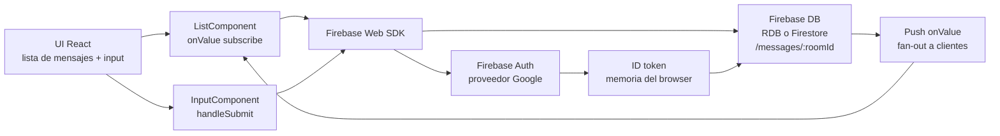

#### 🧠 Visión general del proyecto

Objetivo: un chat pequeño en tiempo real que demuestra que se
puede llevar una aplicación web con forma de producto a
producción en una sola sesión usando React en el cliente y
Firebase en el backend. Sin servidor que aprovisionar, sin base
de datos de autenticación que mantener, sin plumbing de WebSocket
que cablear — login con Google para identidad y una base de
datos en tiempo real para mensajes, después un deploy de una
línea a Firebase Hosting.

Fue un proyecto de onboarding al stack React + Firebase en una
época en la que Firebase Realtime Database todavía era la forma
más simple de cablear estado en vivo desde un navegador sin
pararse a montar un backend. El outcome buscado no era
profundidad de features; era internalizar el loop de deploy y
el flujo de auth para que el proyecto siguiente pudiera empezar
un paso más adelante.

Funcionalidades actuales:

- Login con Google vía Firebase Authentication — un click, sin
  password almacenado en ningún lado, sin flujo de verificación
  de email.
- Línea de tiempo de mensajes por usuario persistida en
  Firebase Realtime Database, con insert optimista en la UI
  para que el usuario vea su propio mensaje aparecer antes de
  que termine el round-trip.
- Sync de mensajes en vivo entre pestañas y dispositivos
  abiertos — cada mensaje nuevo en la base se empuja hacia
  abajo a cada cliente conectado en la misma sala.
- UI ligera: un avatar de Google + nombre para mostrar por
  mensaje, un único campo de texto abajo y una lista con
  scroll que se reacomoda a medida que llegan entradas nuevas.
- Demo público alojado en `chat-react-c9d77.web.app` vía
  Firebase Hosting, con HTTPS y un CDN global provistos de
  fábrica.

#### 🏗️ Arquitectura: frontend React + backend Firebase

La app es deliberadamente de dos lados: el cliente React es
dueño de la capa de vista, los SDKs de Firebase son dueños de
identidad, persistencia y sync en vivo. No hay un servidor
custom en el loop — toda lectura y escritura va directo del
navegador a un backend de Firebase.

Esta forma nos permite:

- Tirar el backend completo borrando un objeto `firebaseConfig`
  y re-apuntándolo a otro proyecto — no hay servidor que
  re-desplegar.
- Agregar una segunda sala introduciendo un parámetro
  `roomId` y un segundo `<ListComponent />` — el plumbing de
  auth + base de datos no cambia.
- Recuperar el asset desplegado exacto con `firebase serve` o
  re-desplegando desde la misma fuente — Hosting construye un
  bundle con hash y lo sirve desde CDN por path.

#### 🧰 Tecnologías utilizadas

⚛️ Frontend (React)

- **React** como capa de vista — mezcla de componentes
  funcionales y de clase, con estado manejado localmente por
  componente.
- **Firebase Web SDK (`firebase/app`, `firebase/auth`,
  `firebase/database`)** inicializado una vez al arranque de
  la app a partir de un objeto `firebaseConfig`.
- **Listeners de Realtime Database** (`onValue`) cableados al
  componente de la lista de mensajes para que la UI se
  suscriba a las updates en lugar de pollear.
- Una capa fina de **CSS** (sin framework, era acorde a la
  época) para spacing, la barra de input y la burbuja del
  avatar.

☁️ Backend (Firebase, totalmente administrado)

- **Firebase Authentication** con el proveedor de **Google**
  — sin passwords almacenados, login de un click.
- **Firebase Realtime Database** como almacén de mensajes —
  árbol JSON, fan-out en escritura, perfectamente adecuada
  para un chat en vivo.
- **Firebase Hosting** para el bundle estático de React, con
  HTTPS y CDN global; el deploy es un único
  `firebase deploy --only hosting`.

🛠️ Tooling

- **Create React App** como build tool — `npm start`,
  `npm run build`, listo para soltar en la carpeta `public/`
  de Hosting.
- **firebase-tools** como CLI para `firebase init`,
  `firebase deploy` y `firebase serve`.

#### 🔐 Decisiones técnicas clave

✅ 1. Sign-in con Google como único camino de auth

El punto entero del proyecto era sacar de en medio las partes
de "armar un chat" que no son el chat: almacenamiento de
passwords, flujos de reset, verificación de email. Firebase
Authentication con el proveedor de Google colapsa todo eso en
un único botón y vuelve con un display name y una URL de
avatar que la UI puede consumir directo.

✅ 2. Realtime Database en lugar de Firestore

A fines de 2019 la Realtime Database era la elección de menor
fricción para un demo de un archivo: JSON-shaped, sin schema,
sin modelo de collection/document que aprender, listener
`onValue` nativo que mapea casi línea por línea a un
componente de React. El trade-off (sin cache offline, sin
queries compuestas, sin reglas de seguridad orientadas a
documento) era aceptable para un demo y sólo importaría
cuando el modelo de datos le quedara chico al caso de uso
del chat.

✅ 3. Firebase Hosting por encima de un CDN custom

Firebase Hosting nos dio HTTPS, enganche de dominio custom,
un loop de deploy predecible y canales de preview sobre el
mismo proyecto, sin Nginx que escribir y sin cert TLS que
renovar. Para un proyecto tan chico, el costo de operaciones
de cualquier otra opción de hosting hubiera eclipsado el
tiempo ahorrado escribiendo el código.

#### 📈 Resultado actual

✔️ Demo público en vivo en <https://chat-react-c9d77.web.app>,
servido desde Firebase Hosting con HTTPS.

✔️ Login con Google funcionando end-to-end — cualquiera puede
abrir la URL y empezar a mandar mensajes con un solo click.

✔️ Sync de mensajes en vivo verificado entre dos pestañas del
navegador y entre dos dispositivos: un mensaje enviado en un
lugar aparece en el otro dentro del round-trip del push por
WebSocket.

✔️ Source abierto para que cualquiera lo forkeé como punto de
partida — el readme apunta al repo y a la demo en vivo en
tres líneas.

#### 📎 Conclusión

Es el "chat que podés entregar en una sentada" más chico que
igual parece un producto real: auth real, persistencia real,
sync en vivo real, URL pública real. Ninguna de las piezas es
novedosa — cada una es justo para lo que Firebase fue
diseñado — pero la combinación es lo que demuestra que React
+ Firebase sigue siendo uno de los caminos más cortos del
"blank page" al "app desplegada, autenticada y en tiempo
real" cuando el caso de uso encaja.

Las dos cosas más grandes que enseña son el *loop de deploy*
(`firebase deploy` y ya estás en vivo) y el *loop de datos*
(`onValue` y ya estás suscrito). Una vez esas dos están
internalizadas, cada proyecto Firebase posterior puede partir
de una base conocida y probada.

¿Querés leer el código fuente o correr tu propia versión?

- 🔗 [Repositorio](https://github.com/SergioCampbell/ReactChat)
- 🌐 [Demo en vivo](https://chat-react-c9d77.web.app)

##### 🧠 ¿Estás armando tu propia app en tiempo real?

Si estás construyendo algo sobre Firebase Auth + Realtime
Database y querés charlar sobre los trade-offs de la forma
del modelo de datos o el workflow de preview de Hosting,
escribime sin compromiso 🚀
