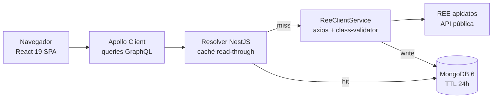

#### 🧠 Visión general del proyecto

Objetivo: tomar la **API pública de REE (`apidatos`)** y convertirla en
un visualizador que responda las preguntas que de verdad se le hacen a
la red eléctrica española — *¿de dónde viene la electricidad ahora
mismo?, ¿cuánto estamos importando de Portugal?, ¿qué cuota renovable
tiene la mezcla esta semana?, ¿cómo viene la demanda este mes?* — sin
obligar a quien pregunta a tirar requests manualmente ni a escribir una
sola línea de código.

Ree View se apoya en los endpoints abiertos que REE publica:
generación por tecnología, demanda del sistema, intercambios
internacionales en las fronteras con Francia / Portugal / Andorra /
Marruecos y balance de almacenamiento (bombeo + baterías). El frontend
incluye un selector de rango de fechas y un filtro de tipo de energía
(renovable vs. no-renovable), y el backend cachea cada respuesta de
REE en MongoDB con un TTL de 24h, de modo que una sesión de
exploración intensa nunca termina pegando contra los límites de tasa
de la API pública.

Funcionalidades actuales:

- **Filtro de rango de fechas** vía `react-datepicker`, con validación
  en ambos extremos para que el resolver GraphQL nunca vea un rango
  mal formado.
- **Desglose de generación por tecnología** — eólica, solar
  fotovoltaica, hidráulica, nuclear, gas natural, carbón y resto — con
  totales y porcentaje de participación, renderizado como un
  `BarChart` apilado de `recharts`.
- **Demanda promedio del sistema** graficada a lo largo del rango
  elegido.
- **Intercambios internacionales** en las cuatro fronteras ibéricas,
  con signo positivo para importación y negativo para exportación, y
  una tarjeta de dashboard por vecino.
- **Balance de almacenamiento** para bombeo y baterías
  (carga / descarga).
- **Tema claro / oscuro** vía design tokens, sin parpadeo de estilo en
  el primer paint.

#### 🏗️ Arquitectura: GraphQL read-through sobre REE

El runtime son dos aplicaciones cableadas sobre GraphQL — una SPA de
Vite del lado del navegador y una capa de resolvers de NestJS frente a
la API pública de REE del lado del servidor — más una instancia de
MongoDB que se ubica delante de REE como caché read-through.



Esta forma nos permite:

- Tratar a REE como un upstream intercambiable reemplazando
  `ReeClientService` por otro cliente HTTP — todos los resolvers
  pasan por esa única costura.
- Convertir el TTL de la caché en una perilla (`THROTTLE_TTL_MS`) sin
  tocar código — la lógica read-through vive en el decorator del
  resolver.
- Levantar el stack entero con un único `docker-compose up` — backend,
  frontend y Mongo arrancan juntos con healthchecks y un volumen de
  Mongo precalentado.
- Iterar sobre el lado React contra un backend mockeado en dev
  invirtiendo una variable de entorno, así el loop de UI nunca se
  bloquea esperando a la API pública.

#### 🧰 Tecnologías utilizadas

⚛️ Frontend (`frontend/`)

- **React 19** con render concurrente para aguantar el dashboard
  pesado en gráficos sin trabarse en rangos largos de fechas.
- **Vite 6** como dev server y build de producción — el hot reload
  sobre el contrato GraphQL es el loop de iteración que más importa
  acá.
- **TypeScript** de punta a punta, con tipos generados desde GraphQL
  enchufando directo en las props de los componentes.
- **Apollo Client** como cliente GraphQL, con un único `HttpLink`
  apuntando al endpoint del backend.
- **Tailwind CSS 4** con design tokens que tematizan claro y oscuro
  sin una capa de CSS-in-JS en runtime.
- **recharts** para los `BarChart` / `LineChart` responsivos que
  renderizan generación, demanda y series de intercambios.
- **react-datepicker** para el input de rango de fechas, con hooks
  de validación atados al contrato del resolver.

🔙 Backend (`backend/`)

- **NestJS 10** como framework de aplicación — los módulos, el DI,
  los decorators y los hooks de lifecycle calzan 1:1 con la superficie
  GraphQL.
- **GraphQL (Apollo Server)** como único contrato entre el frontend y
  el backend — no hay rutas REST que mantener sincronizadas.
- **Mongoose** como ODM sobre **MongoDB 6** para la caché de
  respuestas.
- **Axios** como cliente HTTP contra los endpoints de REE.
- **@nestjs/throttler** como guard global de rate-limit sobre la capa
  GraphQL, dimensionado para que una sesión exploratoria nunca cruce
  los límites de la API pública de REE.
- **class-validator** + **class-transformer** para validar la forma
  de los inputs en cada argumento de resolver.

🛠️ Infraestructura

- **Docker Compose** orquestando tres servicios: `backend`,
  `frontend`, `mongo`.
- **Nginx** dentro del contenedor del frontend, sirviendo el build de
  Vite de forma estática y proxeando el endpoint GraphQL hacia el
  backend dentro de la misma red de Compose.
- **Jest** + **Vitest** repartidos entre backend (smoke + integración)
  y frontend (tests de componentes con Vitest).
- Un smoke test `verify-stack.sh` que ejecuta **6 fases
  end-to-end**: stack-up, los 3 resolvers GraphQL, rate-limiting y la
  expiración del TTL en Mongo.

#### 🔐 Decisiones técnicas clave

✅ 1. GraphQL como contrato, REST como upstream

REE expone endpoints REST cuya forma cambia por categoría.
Envolviéndolos detrás de una única capa de resolvers GraphQL, el
cliente React consulta un contrato estable — `generation(range, type)`,
`demand(range)`, `exchanges(range)`, `storage(range)` — mientras el
backend absorbe cada cambio de JSON del upstream en un adaptador
chico. Si mañana REE retira un endpoint, sólo se mueve
`ReeClientService`.

✅ 2. Caché read-through en MongoDB con TTL de 24h

La API pública de REE queda muy por debajo de las
requests-por-segundo que un visualizador produce naturalmente (cada
cambio de filtro es una nueva consulta). El backend cachea cada
respuesta exitosa en una colección `responses` con un índice TTL que
vence los documentos pasadas las 24h, así el costo en estado estable
sobre REE baja de "cada interacción de página" a "una consulta por
(endpoint, día)".

✅ 3. `@nestjs/throttler` para proteger al upstream

La caché oculta el caso *caliente*; `@nestjs/throttler` sobre la
capa de resolvers oculta los casos *frío* y *de abuso*. Juntos
mantienen al proyecto bien dentro de los límites de la API pública
de REE sin sacrificar la respuesta del frontend.

✅ 4. Stack de un comando pineado por healthchecks de Compose

Una persona consumiendo el frontend debería poder preguntar
"¿este stack sigue corriendo end-to-end?" con un único comando. El
Compose de 3 servicios pasa el orden de arranque vía healthchecks,
así `docker-compose up -d --build` siempre converge en un stack
consultable, no en uno levantado a medias.

#### 🚀 Cómo correrlo

Dos caminos que producen la misma app.

**Dev local** (dos terminales, hot reload en ambos lados):

```bash
# backend
cd backend
cp .env.example .env   # ajustar REE_API_URL, MONGODB_URI, CORS_ORIGINS
pnpm install
pnpm run dev           # http://localhost:3000/graphql

# frontend, en una segunda terminal
cd frontend
cp .env.example .env   # VITE_API_URL=http://localhost:3000/graphql
pnpm install
pnpm run dev           # http://localhost:5173
```

**Stack completo con Docker** (un comando):

```bash
docker-compose up -d --build
# Frontend  → http://localhost:80           (Nginx → bundle Vite)
# Backend   → http://localhost:3000/graphql (GraphQL Playground)
# MongoDB   → mongodb://localhost:27017     (DB: energy-balance)
```

Una vez arriba, el smoke test `verify-stack.sh` corre las **6 fases
end-to-end** mencionadas — un sanity check útil después de cada cambio
en el contrato.

#### 📈 Resultado actual

✔️ Visualizador fullstack desplegable con un único
`docker-compose up` y consultable end-to-end vía GraphQL.

✔️ Caché read-through que mantiene plano el tráfico contra REE durante
sesiones exploratorias intensas, con TTL de 24h regulable por env.

✔️ Smoke test pasando las 6 fases end-to-end — stack-up, cada resolver,
el guard de rate-limit y el TTL en Mongo.

✔️ Frontend utilizable contra un backend mockeado en dev, así el
loop de UI nunca se bloquea esperando a la API pública.

#### 📎 Conclusión

Ree View demuestra que una fuente de datos pública en tiempo real
puede alimentar un producto de datos con forma de producción sin
sumar ninguna dependencia cloud: un grafo NestJS frente a REE, una
colección de MongoDB haciendo de caché, una SPA de Vite leyendo el
contrato, y un archivo Compose sosteniéndolos juntos.

Las decisiones arquitectónicas — GraphQL como único contrato, caché
read-through con TTL, throttler sobre la capa de resolvers, y un
stack con healthchecks pineados en Compose — arrancaron menos de la
novedad que de la regla simple de que *la API pública de REE no
debería sentirse como el cuello de botella de la visualización*.

¿Querés leer el código fuente o correrlo localmente con tus propias
credenciales de la API de REE?

- 🔗 [Repositorio](https://github.com/alkiory/ree-view/)
